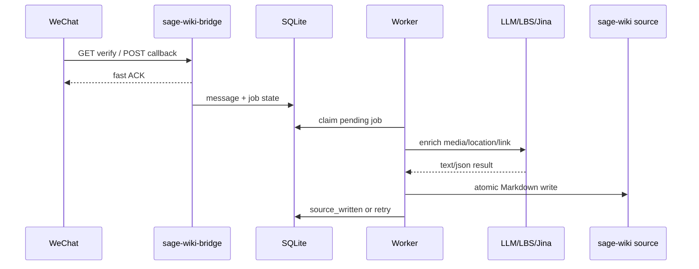

# sage-wiki-bridge

Language: English | [中文](README.zh-CN.md)

`sage-wiki-bridge` is a lightweight Rust service that receives WeChat Official Account callbacks, normalizes incoming messages, and writes daily Markdown source files for `sage-wiki compile --watch`.

## 5W1H

**What:** A bridge from WeChat Official Account messages to a local `sage-wiki` source directory. It accepts text, image, voice, video, short video, location, and link messages, then queues authorized messages for enrichment and source generation.

**Why:** `sage-wiki` can incrementally compile local source files, but WeChat is a low-friction capture surface. This service connects the two while preserving raw inputs and keeping callback handling fast. See the [product design](docs/product-design.en.md) for goals, user journeys, and product constraints.

**Who:** It is for operators who run a private `sage-wiki` instance and want whitelisted WeChat users to submit knowledge into it. Non-whitelisted users are ignored or handled by configurable honeypot behavior.

**When:** Run it alongside `sage-wiki compile --watch`. WeChat calls this service when a user sends a message to the Official Account; the worker later processes queued jobs and writes source files.

**Where:** Deploy it as an independent process on the same VPS or host that can write to the configured `sage-wiki` source directory. It does not need to be a sibling project of `sage-wiki`.

**How:** Configure explicit CLI flags, optionally load secrets from `--env-file`, expose the WeChat callback path through your reverse proxy, and let the worker write Markdown into the source directory. The detailed architecture is in the [technical design](docs/technical-design.en.md).

## Features

- WeChat callback verification and encrypted callback handling.
- Message parsing for text, image, voice, video, short video, location, and link messages.
- OpenID whitelist with configurable honeypot behavior for non-whitelisted senders.
- Raw archive, processed artifact storage, SQLite state, and atomic daily Markdown source writes.
- Separate AI source and verbose source log outputs; see [AI Source Format v1](docs/ai-source-format.en.md) for the target thread format, `/new`, and command policy.
- Gemini-backed media processing, Tencent LBS reverse geocoding, and Jina Reader link extraction.
- Read-only admin message list and detail pages.
- Explicit runtime configuration: `CLI flags > --env-file > --use-process-env > built-in defaults`.

For product behavior and scope decisions, read [docs/product-design.en.md](docs/product-design.en.md). Target AI source/thread rules are in [docs/ai-source-format.en.md](docs/ai-source-format.en.md). For module boundaries, data flow, schema, retry behavior, and operations details, read [docs/technical-design.en.md](docs/technical-design.en.md).

## Build

```sh
cargo build --release
```

The release binary is:

```sh
target/release/sage-wiki-bridge
```

## Configuration

The service does not implicitly load `.env`. Every external config source must be enabled explicitly.

```sh
sage-wiki-bridge --help
```

Config precedence is:

```text
CLI flags > --env-file PATH > --use-process-env > built-in defaults
```

Recommended deployment pattern:

- Put secrets and environment-specific overrides in one explicit `.env` file.
- Use `BRIDGE_*` only for values that differ from binary defaults.
- Avoid `--use-process-env` unless the process environment is intentionally managed.

Example production `.env`:

```sh
BRIDGE_BIND_ADDR=127.0.0.1:8087
BRIDGE_WECHAT_CALLBACK_PATH=/wechat
BRIDGE_WECHAT_ENCRYPTED_CALLBACK_ENABLED=true
BRIDGE_SAGE_WIKI_SOURCE_DIR=/data/workspace/sage-wiki/source
# Optional: verbose audit log with the old daily source format.
# BRIDGE_SAGE_WIKI_SOURCE_LOG_DIR=/data/workspace/sage-wiki-bridge-wxo/data/source-log

WECHAT_TOKEN=...
WECHAT_APP_ID=...
WECHAT_APP_SECRET=...
WECHAT_ENCODING_AES_KEY=...
WECHAT_ADMIN_OPENIDS=openid1,openid2
GEMINI_API_KEY=...
TENCENT_LBS_KEY=...
JINA_API_KEY=...
ADMIN_VIEW_KEY=...
```

See [.env.example](.env.example) for the single dotenv file passed to the binary by both systemd and manual diagnostics. The full configuration model and rationale are described in [the technical design configuration section](docs/technical-design.en.md).

## Run

Minimal local run:

```sh
cargo run --bin sage-wiki-bridge -- \
  --env-file .env
```

When `--whitelist-join-command` is set, a WeChat text message that exactly matches the command adds that sender's `FromUserName` OpenID to the whitelist. The command message is recorded but does not create a `sage-wiki` job.

Health checks:

```sh
curl http://127.0.0.1:8080/healthz
curl http://127.0.0.1:8080/readyz
```

Runtime inspection:

```sh
sage-wiki-bridge --version
sage-wiki-bridge version
sage-wiki-bridge -V --env-file .env --database-url sqlite://data/bridge.sqlite3
sage-wiki-bridge status --env-file .env --database-url sqlite://data/bridge.sqlite3
sage-wiki-bridge doctor --env-file .env
sage-wiki-bridge health --env-file .env
sage-wiki-bridge ready --env-file .env
```

`-V` prints the package version, build target, resolved config values, and the source of each value without starting the service. `status` first tries the running `{ADMIN_BASE_PATH}/status` endpoint with `ADMIN_VIEW_KEY`; if the process is not reachable, it falls back to the configured SQLite snapshot. Secrets are redacted.

The running service also exposes a protected JSON status endpoint:

```sh
curl -H "Authorization: Bearer $ADMIN_VIEW_KEY" http://127.0.0.1:8087/admin/status
```

Standard production operations:

```sh
cd /data/workspace/sage-wiki-bridge-wxo
sudo scripts/bridgectl.sh doctor
sudo scripts/bridgectl.sh service-status
sudo scripts/bridgectl.sh health
sudo scripts/bridgectl.sh ready
sudo scripts/bridgectl.sh status
sudo scripts/bridgectl.sh tail
```

`scripts/bridgectl.sh` is a thin compatibility wrapper. Startup, `-V`, `status`, `doctor`, `health`, and `ready` are implemented by the Rust binary itself; the wrapper keeps only journald/systemctl helpers and the default production env-file path.

## Deployment

Systemd templates are in [deploy/systemd](deploy/systemd). The unit starts the binary directly:

```sh
/usr/local/bin/sage-wiki-bridge --env-file /data/workspace/sage-wiki-bridge-wxo/.env
```

The binary natively reads secrets and `BRIDGE_*` operational overrides from the same explicit env file.

Before installing, review the production `.env` values:

- `BRIDGE_BIND_ADDR`
- `BRIDGE_WECHAT_CALLBACK_PATH`
- `BRIDGE_WECHAT_ENCRYPTED_CALLBACK_ENABLED`
- `BRIDGE_SAGE_WIKI_SOURCE_DIR`
- `BRIDGE_SAGE_WIKI_SOURCE_LOG_DIR` if the default `data/source-log` is not suitable
- `ReadWritePaths`
- `MemoryMax`

The deployment model and recovery expectations are covered in [docs/technical-design.en.md](docs/technical-design.en.md).

## Testing

Run the full test suite:

```sh
cargo test
```

Replay recorded WeChat callbacks against a local service:

```sh
cd /Volumes/RamDisk/wechat-official-callback-replay
python3 replay.py http://127.0.0.1:<port>/wechat
```

If the replay script dependency is unavailable, replay can be done with any HTTP client that sends the recorded query params, headers, and XML body.

## Runtime Flow



The product-level flow is explained in [the PRD](docs/product-design.en.md). The implementation-level component split is explained in [the technical design](docs/technical-design.en.md).

## Documentation

- [Product Design / PRD](docs/product-design.en.md): background, users, goals, message handling scope, and product decisions.
- [Technical Design](docs/technical-design.en.md): architecture, modules, data model, logging, disaster recovery, deployment, and testing strategy.
- [Operations Runbook](docs/operations.en.md): production deployment, diagnostics, and callback troubleshooting.
- [Changelog](CHANGELOG.md): notable changes and version history.
- [中文 README](README.zh-CN.md): Chinese project entry.
- [Systemd Deployment Notes](deploy/systemd/README.md): Linux service installation outline.
- [.env.example](.env.example): secrets and environment-bound identifiers for explicit `--env-file` loading.

## Current Status

The project has implemented the core bridge, worker, storage, admin, encrypted callback, and explicit configuration model. The full Rust test suite passes, and recorded WeChat callback replay has been validated locally.
