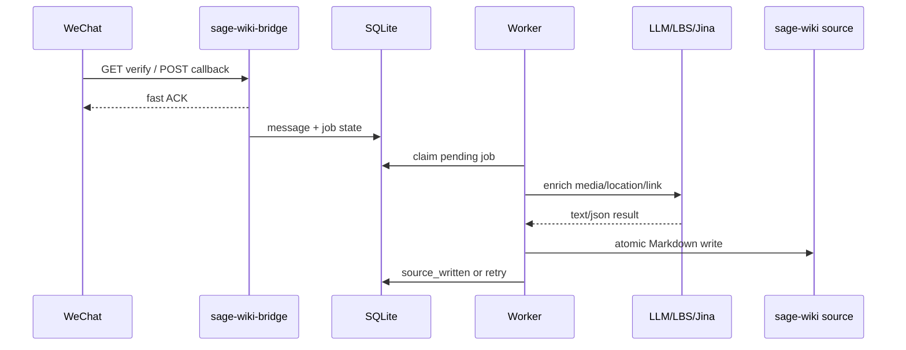

# sage-wiki-bridge

Language: English | [中文](README.zh-CN.md)

`sage-wiki-bridge` is a lightweight Rust service that receives WeChat Official Account callbacks, normalizes incoming messages, and writes Markdown source files for `sage-wiki compile --watch`.

## 5W1H

**What:** A bridge from WeChat Official Account messages to a local `sage-wiki` source directory. It accepts text, image, voice, video, short video, location, and link messages, then queues authorized messages for enrichment and source generation.

**Why:** `sage-wiki` can incrementally compile local source files, but WeChat is a low-friction capture surface. This service connects the two while preserving raw inputs and keeping callback handling fast. See the [product design](docs/product-design.en.md) for goals, user journeys, and product constraints.

**Who:** It is for operators who run a private `sage-wiki` instance and want whitelisted WeChat users to submit knowledge into it. Non-whitelisted users are ignored or handled by configurable honeypot behavior.

**When:** Run it alongside `sage-wiki compile --watch`. WeChat calls this service when a user sends a message to the Official Account; the worker later processes queued jobs and writes source files.

**Where:** Deploy it as an independent process on the same VPS or host that can write to the configured `sage-wiki` source directory. It does not need to be a sibling project of `sage-wiki`.

**How:** Configure explicit CLI flags, optionally load secrets from `--env-file`, expose the WeChat callback path through your reverse proxy, and let the worker write Markdown into the source directory. The detailed architecture is in the [technical design](docs/technical-design.en.md).

## Features

- WeChat callback verification and encrypted callback handling.
- Message parsing for text, image, voice, video, short video, location, and link messages.
- OpenID whitelist with configurable honeypot behavior for non-whitelisted senders.
- Raw archive, processed artifact storage, SQLite state, and atomic Markdown source writes.
- Gemini-backed media processing, Tencent LBS reverse geocoding, and Jina Reader link extraction.
- Read-only admin message list and detail pages.
- Explicit runtime configuration: `CLI flags > --env-file > --use-process-env > built-in defaults`.

For product behavior and scope decisions, read [docs/product-design.en.md](docs/product-design.en.md). For module boundaries, data flow, schema, retry behavior, and operations details, read [docs/technical-design.en.md](docs/technical-design.en.md).

## Build

```sh
cargo build --release
```

The release binary is:

```sh
target/release/sage-wiki-bridge
```

## Configuration

The service does not implicitly load `.env`. Every external config source must be enabled explicitly.

```sh
sage-wiki-bridge --help
```

Config precedence is:

```text
CLI flags > --env-file PATH > --use-process-env > built-in defaults
```

Recommended deployment pattern:

- Put operational settings in CLI flags or the systemd `ExecStart`.
- Put secrets in an explicit env file loaded with `--env-file`.
- Avoid `--use-process-env` unless the process environment is intentionally managed.

Example secrets file:

```sh
WECHAT_TOKEN=...
WECHAT_APP_ID=...
WECHAT_APP_SECRET=...
WECHAT_ENCODING_AES_KEY=...
WECHAT_ADMIN_OPENIDS=openid1,openid2
GEMINI_API_KEY=...
TENCENT_LBS_KEY=...
JINA_API_KEY=...
ADMIN_VIEW_KEY=...
WHITELIST_JOIN_KEY=...
```

See [.env.example](.env.example) and [deploy/systemd/sage-wiki-bridge.env.example](deploy/systemd/sage-wiki-bridge.env.example) for secrets-only env file examples. Runtime knobs should be passed as CLI flags, not duplicated in dotenv files. The full configuration model and rationale are described in [the technical design configuration section](docs/technical-design.en.md).

## Run

Minimal local run:

```sh
cargo run --bin sage-wiki-bridge -- \
  --env-file .env \
  --bind-addr 127.0.0.1:8080 \
  --database-url sqlite://data/bridge.sqlite3 \
  --raw-archive-dir data/raw \
  --processed-artifact-dir data/processed \
  --sage-wiki-source-dir /path/to/sage-wiki/source \
  --wechat-callback-path /wechat/callback
```

Health checks:

```sh
curl http://127.0.0.1:8080/healthz
curl http://127.0.0.1:8080/readyz
```

## Deployment

Systemd templates are in [deploy/systemd](deploy/systemd). The unit keeps non-secret runtime knobs in `ExecStart` and loads secrets explicitly with `--env-file /etc/sage-wiki-bridge.env`.

Before installing, review:

- `--database-url`
- `--raw-archive-dir`
- `--processed-artifact-dir`
- `--sage-wiki-source-dir`
- `--wechat-callback-path`
- `ReadWritePaths`
- `MemoryMax`

The deployment model and recovery expectations are covered in [docs/technical-design.en.md](docs/technical-design.en.md).

## Testing

Run the full test suite:

```sh
cargo test
```

Replay recorded WeChat callbacks against a local service:

```sh
cd /Volumes/RamDisk/wechat-official-callback-replay
python3 replay.py http://127.0.0.1:<port>/wechat
```

If the replay script dependency is unavailable, replay can be done with any HTTP client that sends the recorded query params, headers, and XML body.

## Runtime Flow



The product-level flow is explained in [the PRD](docs/product-design.en.md). The implementation-level component split is explained in [the technical design](docs/technical-design.en.md).

## Documentation

- [Product Design / PRD](docs/product-design.en.md): background, users, goals, message handling scope, and product decisions.
- [Technical Design](docs/technical-design.en.md): architecture, modules, data model, logging, disaster recovery, deployment, and testing strategy.
- [中文 README](README.zh-CN.md): Chinese project entry.
- [Systemd Deployment Notes](deploy/systemd/README.md): Linux service installation outline.
- [.env.example](.env.example): secrets and environment-bound identifiers for explicit `--env-file` loading.

## Current Status

The project has implemented the core bridge, worker, storage, admin, encrypted callback, and explicit configuration model. The full Rust test suite passes, and recorded WeChat callback replay has been validated locally.
