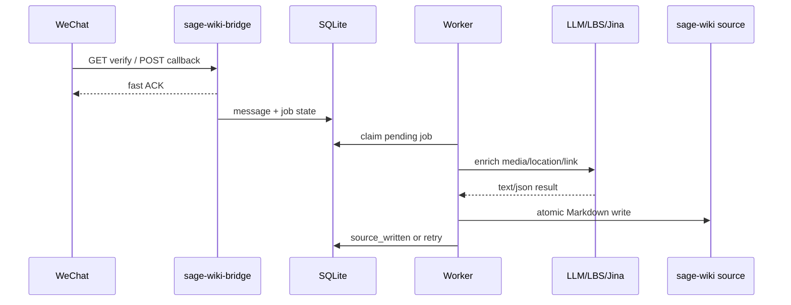

# sage-wiki-bridge

语言: [English](README.md) | 中文

`sage-wiki-bridge` 是一个轻量 Rust 服务，用于接收微信公众号 callback，解析并处理用户消息，然后把结果写入 `sage-wiki compile --watch` 监听的 Markdown source 目录。

## 5W1H

**What:** 一个微信公众号到本地 `sage-wiki` source 目录的桥接服务。它接收 text、image、voice、video、shortvideo、location、link 等消息，并把白名单用户的支持消息放入异步处理队列。

**Why:** `sage-wiki` 可以增量编译本地 source 文件，而微信是低摩擦的信息输入入口。这个服务负责把两者接起来，同时保留原始输入、快速响应微信 callback。产品目标和边界见 [产品设计 / PRD](docs/product-design.zh-CN.md)。

**Who:** 面向运行私有 `sage-wiki` 的管理员，以及被加入白名单、希望通过微信投递知识的用户。非白名单用户只走 ignored 或蜜罐逻辑，不触发真实处理。

**When:** 与 `sage-wiki compile --watch` 并行常驻运行。当用户向公众号发送消息时，微信公众号后台会调用本服务 callback；worker 随后异步处理队列并写入 source。

**Where:** 部署在可以写入 `sage-wiki` source 目录的 VPS 或主机上。它是独立项目，不要求与 `sage-wiki` 是兄弟目录或共享代码风格。

**How:** 通过显式 CLI 参数配置运行时行为，可选用 `--env-file` 显式加载 secrets；反代暴露微信 callback 路径；worker 处理消息并原子写入 Markdown source。详细架构见 [技术设计](docs/technical-design.zh-CN.md)。

## 功能

- 微信 callback 接入验证、普通明文 callback、加密 callback。
- 解析 text、image、voice、video、shortvideo、location、link。
- OpenID 白名单和非白名单蜜罐逻辑。
- raw archive、processed artifact、SQLite 状态和原子 Markdown source 写入。
- Gemini 媒体理解、腾讯 LBS 逆地址解析、Jina Reader 链接读取。
- 只读后台列表页和详情页。
- 显式运行配置: `CLI flags > --env-file > --use-process-env > built-in defaults`。

产品行为、用户场景和取舍见 [docs/product-design.zh-CN.md](docs/product-design.zh-CN.md)。模块边界、数据流、schema、重试和运维细节见 [docs/technical-design.zh-CN.md](docs/technical-design.zh-CN.md)。

## 构建

```sh
cargo build --release
```

release binary:

```sh
target/release/sage-wiki-bridge
```

## 配置

服务不会隐式加载 `.env`。所有外部配置来源都必须显式启用。

```sh
sage-wiki-bridge --help
```

配置优先级:

```text
CLI flags > --env-file PATH > --use-process-env > built-in defaults
```

推荐部署方式:

- 运行参数放在 CLI flags 或 systemd `ExecStart`。
- secrets 放在通过 `--env-file` 显式加载的文件里。
- 除非进程环境由你明确管理，否则不要使用 `--use-process-env`。

secrets 文件示例:

```sh
WECHAT_TOKEN=...
WECHAT_APP_ID=...
WECHAT_APP_SECRET=...
WECHAT_ENCODING_AES_KEY=...
WECHAT_ADMIN_OPENIDS=openid1,openid2
GEMINI_API_KEY=...
TENCENT_LBS_KEY=...
JINA_API_KEY=...
ADMIN_VIEW_KEY=...
WHITELIST_JOIN_KEY=...
```

参考 [.env.example](.env.example) 和 [deploy/systemd/sage-wiki-bridge.env.example](deploy/systemd/sage-wiki-bridge.env.example)，这两个文件只放 secrets 和环境强相关标识。运行参数应通过 CLI flags 传递，不要在 dotenv 中重复配置。完整配置模型见 [技术设计](docs/technical-design.zh-CN.md)。

## 运行

本地最小运行示例:

```sh
cargo run --bin sage-wiki-bridge -- \
  --env-file .env \
  --bind-addr 127.0.0.1:8080 \
  --database-url sqlite://data/bridge.sqlite3 \
  --raw-archive-dir data/raw \
  --processed-artifact-dir data/processed \
  --sage-wiki-source-dir /path/to/sage-wiki/source \
  --wechat-callback-path /wechat/callback
```

健康检查:

```sh
curl http://127.0.0.1:8080/healthz
curl http://127.0.0.1:8080/readyz
```

## 部署

systemd 模板在 [deploy/systemd](deploy/systemd)。unit 把非 secret 的运行参数写在 `ExecStart`，并通过 `--env-file /etc/sage-wiki-bridge.env` 显式加载 secrets。

部署前需要核对:

- `--database-url`
- `--raw-archive-dir`
- `--processed-artifact-dir`
- `--sage-wiki-source-dir`
- `--wechat-callback-path`
- `ReadWritePaths`
- `MemoryMax`

部署和灾备细节见 [技术设计](docs/technical-design.zh-CN.md)。

## 测试

运行完整测试:

```sh
cargo test
```

回放真实微信公众号 callback 记录:

```sh
cd /Volumes/RamDisk/wechat-official-callback-replay
python3 replay.py http://127.0.0.1:<port>/wechat
```

如果 replay 脚本依赖不可用，也可以用任意 HTTP client 发送保存的 query params、headers 和 XML body。

## 运行流程



产品层面的链路见 [PRD](docs/product-design.zh-CN.md)，实现层面的组件拆分见 [技术设计](docs/technical-design.zh-CN.md)。

## 文档

- [产品设计 / PRD](docs/product-design.zh-CN.md): 背景、用户、目标、消息处理范围和产品决策。
- [技术设计](docs/technical-design.zh-CN.md): 架构、模块、数据模型、日志、灾备、部署和测试策略。
- [Systemd 部署说明](deploy/systemd/README.md): Linux service 安装流程。
- [.env.example](.env.example): 显式 `--env-file` 加载的 secrets 和环境强相关标识示例。
- [English README](README.md): 英文项目入口。

## 当前状态

项目已实现核心 bridge、worker、storage、admin、加密 callback 和显式配置模型。Rust 全量测试通过，真实微信公众号 callback records 已在本地回放验证。
