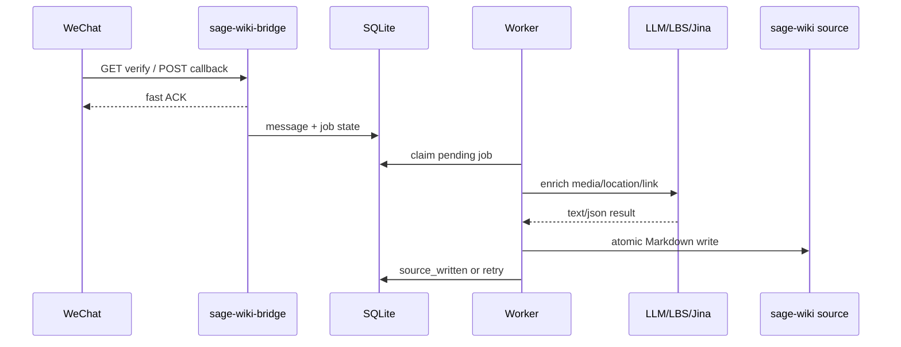

# sage-wiki-bridge

语言: [English](README.md) | 中文

`sage-wiki-bridge` 是一个轻量 Rust 服务，用于接收微信公众号 callback，解析并处理用户消息，然后按天写入 `sage-wiki compile --watch` 监听的 Markdown source 文件。

## 5W1H

**What:** 一个微信公众号到本地 `sage-wiki` source 目录的桥接服务。它接收 text、image、voice、video、shortvideo、location、link 等消息，并把白名单用户的支持消息放入异步处理队列。

**Why:** `sage-wiki` 可以增量编译本地 source 文件，而微信是低摩擦的信息输入入口。这个服务负责把两者接起来，同时保留原始输入、快速响应微信 callback。产品目标和边界见 [产品设计 / PRD](docs/product-design.zh-CN.md)。

**Who:** 面向运行私有 `sage-wiki` 的管理员，以及被加入白名单、希望通过微信投递知识的用户。非白名单用户只走 ignored 或蜜罐逻辑，不触发真实处理。

**When:** 与 `sage-wiki compile --watch` 并行常驻运行。当用户向公众号发送消息时，微信公众号后台会调用本服务 callback；worker 随后异步处理队列并写入 source。

**Where:** 部署在可以写入 `sage-wiki` source 目录的 VPS 或主机上。它是独立项目，不要求与 `sage-wiki` 是兄弟目录或共享代码风格。

**How:** 通过显式 CLI 参数配置运行时行为，可选用 `--env-file` 显式加载 secrets；反代暴露微信 callback 路径；worker 处理消息并原子写入 Markdown source。详细架构见 [技术设计](docs/technical-design.zh-CN.md)。

## 功能

- 微信 callback 接入验证、普通明文 callback、加密 callback。
- 解析 text、image、voice、video、shortvideo、location、link。
- OpenID 白名单和非白名单蜜罐逻辑。
- raw archive、processed artifact、SQLite 状态和按天聚合的原子 Markdown source 写入。
- AI source 与详细 source log 分离；目标 thread 格式、`/new` 边界和 command 策略见 [AI Source Format v1](docs/ai-source-format.zh-CN.md)。
- Gemini 媒体理解、腾讯 LBS 逆地址解析、Jina Reader 链接读取。
- 只读后台列表页和详情页。
- 显式运行配置: `CLI flags > --env-file > --use-process-env > built-in defaults`。

产品行为、用户场景和取舍见 [docs/product-design.zh-CN.md](docs/product-design.zh-CN.md)。AI source/thread 目标规范见 [docs/ai-source-format.zh-CN.md](docs/ai-source-format.zh-CN.md)。模块边界、数据流、schema、重试和运维细节见 [docs/technical-design.zh-CN.md](docs/technical-design.zh-CN.md)。

## 构建

```sh
cargo build --release
```

release binary:

```sh
target/release/sage-wiki-bridge
```

## 配置

服务不会隐式加载 `.env`。所有外部配置来源都必须显式启用。

```sh
sage-wiki-bridge --help
```

配置优先级:

```text
CLI flags > --env-file PATH > --use-process-env > built-in defaults
```

推荐部署方式:

- secrets 和环境相关覆盖项放在同一个显式 `.env` 文件里。
- 只有与二进制默认值不同的配置才写 `BRIDGE_*`。
- 除非进程环境由你明确管理，否则不要使用 `--use-process-env`。

生产 `.env` 示例:

```sh
BRIDGE_BIND_ADDR=127.0.0.1:8087
BRIDGE_WECHAT_CALLBACK_PATH=/wechat
BRIDGE_WECHAT_ENCRYPTED_CALLBACK_ENABLED=true
BRIDGE_SAGE_WIKI_SOURCE_DIR=/data/workspace/sage-wiki/source
# 可选：旧版 daily source 格式的详细审计日志。
# BRIDGE_SAGE_WIKI_SOURCE_LOG_DIR=/data/workspace/sage-wiki-bridge-wxo/data/source-log

WECHAT_TOKEN=...
WECHAT_APP_ID=...
WECHAT_APP_SECRET=...
WECHAT_ENCODING_AES_KEY=...
WECHAT_ADMIN_OPENIDS=openid1,openid2
GEMINI_API_KEY=...
TENCENT_LBS_KEY=...
JINA_API_KEY=...
ADMIN_VIEW_KEY=...
```

参考 [.env.example](.env.example)，systemd 和手工诊断都会把这一份 dotenv 显式传给 binary。完整配置模型见 [技术设计](docs/technical-design.zh-CN.md)。

## 运行

本地最小运行示例:

```sh
cargo run --bin sage-wiki-bridge -- \
  --env-file .env
```

配置 `--whitelist-join-command` 后，用户给公众号发送完全匹配的文本消息时，服务会把该消息的 `FromUserName` OpenID 加入白名单。该 command 消息会入库留痕，但不会创建 `sage-wiki` 处理 job。

健康检查:

```sh
curl http://127.0.0.1:8080/healthz
curl http://127.0.0.1:8080/readyz
```

运行时检查:

```sh
sage-wiki-bridge --version
sage-wiki-bridge version
sage-wiki-bridge -V --env-file .env --database-url sqlite://data/bridge.sqlite3
sage-wiki-bridge status --env-file .env --database-url sqlite://data/bridge.sqlite3
sage-wiki-bridge doctor --env-file .env
sage-wiki-bridge health --env-file .env
sage-wiki-bridge ready --env-file .env
```

`-V` 会打印 package version、构建目标、解析后的配置值和每个值的来源，但不会启动服务。`status` 会优先用 `ADMIN_VIEW_KEY` 请求正在运行的 `{ADMIN_BASE_PATH}/status`；如果进程不可达，再回退到配置指向的 SQLite 快照。secrets 会被脱敏。

运行中的服务还提供受保护的 JSON 状态接口:

```sh
curl -H "Authorization: Bearer $ADMIN_VIEW_KEY" http://127.0.0.1:8087/admin/status
```

生产环境标准运维命令:

```sh
cd /data/workspace/sage-wiki-bridge-wxo
sudo scripts/bridgectl.sh doctor
sudo scripts/bridgectl.sh service-status
sudo scripts/bridgectl.sh health
sudo scripts/bridgectl.sh ready
sudo scripts/bridgectl.sh status
sudo scripts/bridgectl.sh tail
```

`scripts/bridgectl.sh` 现在只是很薄的兼容入口。启动、`-V`、`status`、`doctor`、`health`、`ready` 都由 Rust binary 自己实现；脚本只保留 journald/systemctl 辅助命令和生产 env-file 默认路径。

## 部署

systemd 模板在 [deploy/systemd](deploy/systemd)。unit 直接启动 binary:

```sh
/usr/local/bin/sage-wiki-bridge --env-file /data/workspace/sage-wiki-bridge-wxo/.env
```

binary 原生读取这同一份显式 env file 中的 secrets 和 `BRIDGE_*` 运行覆盖项。

部署前需要核对生产 `.env`:

- `BRIDGE_BIND_ADDR`
- `BRIDGE_WECHAT_CALLBACK_PATH`
- `BRIDGE_WECHAT_ENCRYPTED_CALLBACK_ENABLED`
- `BRIDGE_SAGE_WIKI_SOURCE_DIR`
- `BRIDGE_SAGE_WIKI_SOURCE_LOG_DIR`，如果默认 `data/source-log` 不适合
- `ReadWritePaths`
- `MemoryMax`

部署和灾备细节见 [技术设计](docs/technical-design.zh-CN.md)。

## 测试

运行完整测试:

```sh
cargo test
```

回放真实微信公众号 callback 记录:

```sh
cd /Volumes/RamDisk/wechat-official-callback-replay
python3 replay.py http://127.0.0.1:<port>/wechat
```

如果 replay 脚本依赖不可用，也可以用任意 HTTP client 发送保存的 query params、headers 和 XML body。

## 运行流程



产品层面的链路见 [PRD](docs/product-design.zh-CN.md)，实现层面的组件拆分见 [技术设计](docs/technical-design.zh-CN.md)。

## 文档

- [产品设计 / PRD](docs/product-design.zh-CN.md): 背景、用户、目标、消息处理范围和产品决策。
- [技术设计](docs/technical-design.zh-CN.md): 架构、模块、数据模型、日志、灾备、部署和测试策略。
- [运维 Runbook](docs/operations.zh-CN.md): 生产部署、诊断和 callback 排查流程。
- [Changelog](CHANGELOG.md): 重要变更和版本历史。
- [Systemd 部署说明](deploy/systemd/README.md): Linux service 安装流程。
- [.env.example](.env.example): 显式 `--env-file` 加载的 secrets 和环境强相关标识示例。
- [English README](README.md): 英文项目入口。

## 当前状态

项目已实现核心 bridge、worker、storage、admin、加密 callback 和显式配置模型。Rust 全量测试通过，真实微信公众号 callback records 已在本地回放验证。
