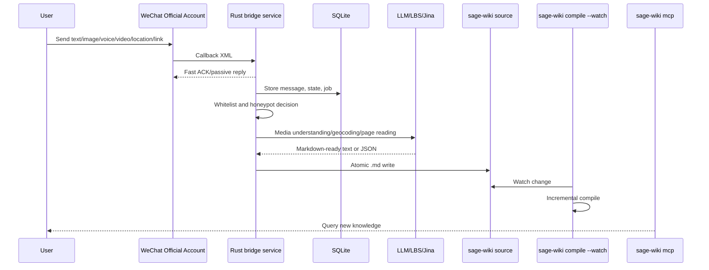

# sage-wiki WeChat Official Account Bridge Product Design

Language: English | [中文](product-design.zh-CN.md)

Research date: 2026-05-27  
Revision date: 2026-05-27  
Primary constraint: independent project, target VPS total memory 1.65 GB, normal RSS below 150 MB, hard process budget 256 MB.  
Product position: a low-resource resident bridge from WeChat Official Account messages to a `sage-wiki` source directory.

## 1. Background

`sage-wiki compile --watch` can watch a local source directory and compile incrementally. This service receives messages sent to a WeChat Official Account, preserves the raw inputs, converts supported content into Markdown source, and lets `sage-wiki mcp` make the information available quickly.

Target flow:

## 2. Product Goals

- Whitelisted users can submit knowledge to `sage-wiki` directly through WeChat.
- Text messages become Markdown source directly.
- Image, voice, video, and short video messages preserve original media first, then use a configurable model to produce searchable text.
- Location messages call Tencent LBS reverse geocoding, preserving both original coordinates and returned JSON.
- Link messages call Jina Reader and use page content as the primary source body while preserving the original URL as metadata.
- Non-whitelisted users do not trigger media download, LLM calls, Tencent LBS, Jina Reader, or source writes.
- Operators can inspect received messages, processing results, errors, and source paths from a read-only admin UI.
- The service must run comfortably on a small VPS with low memory and observable behavior.

## 3. Users

- Operator: deploys the service, configures WeChat, manages secrets and whitelist, checks logs and admin pages.
- Whitelisted sender: sends messages in WeChat and expects useful content to enter `sage-wiki`.
- Non-whitelisted sender: receives configured honeypot behavior and does not trigger real processing.
- `sage-wiki`: consumes only the generated source files; the bridge does not write into a `sage-wiki` database.

## 4. Message Scope

Supported WeChat standard message types:

| Type | Product Behavior |
| --- | --- |
| `text` | Store raw text and queue direct Markdown source generation. |
| `image` | Download media, preserve original file, send to configured multimodal model. |
| `voice` | Download media, preserve original file, send to configured multimodal or ASR model. |
| `video` | Download media and thumbnail when available, preserve files, send to configured model. |
| `shortvideo` | Same handling pattern as video while preserving type information. |
| `location` | Store coordinates and call Tencent LBS reverse geocoding. |
| `link` | Preserve URL/title/description and call Jina Reader. |

Other message and event types are accepted but marked unsupported or ignored.

## 5. Authentication and Whitelist

OpenID is the MVP whitelist subject. UnionID is not assumed to be present. A configured list of admin OpenIDs can be seeded at startup. For subscription accounts without WeChat web authorization, whitelist self-join uses a configured magic text command sent to the Official Account; the receiver adds the callback `FromUserName` OpenID to the whitelist.

Non-whitelisted messages are not processed by external services. Honeypot response behavior is configurable.

The planned first user-facing command set should stay small:

- `/new`: end the current AI source context; the next non-command message starts a new thread.
- `/status`: return recent processing summary and failures.
- `/help`: return a short command list.

Ordinary messages should not receive per-message replies by default. Target AI source thread grouping uses same OpenID plus a conservative 30-minute window, with `/new` as the explicit boundary. See [AI Source Format v1](ai-source-format.en.md) for format and implementation status.

## 6. Operational Expectations

- Callback handling must respond quickly and avoid synchronous external calls.
- Expensive work must be done asynchronously by the worker.
- Raw inputs, processed artifacts, and final Markdown source are separate storage boundaries.
- Runtime configuration must be explicit: CLI flags are preferred, `--env-file` is explicit, and process env is used only with `--use-process-env`.
- Secrets are not written to SQLite or normal logs.

## 7. Success Criteria

- WeChat callback replay returns 200 for supported encrypted callback samples.
- Whitelisted supported messages are queued and eventually become Markdown source.
- Non-whitelisted supported messages are ignored or honeypot-handled without creating jobs.
- `sage-wiki compile --watch` observes generated source files.
- The service remains within the target memory budget under normal load.

## 8. Related Documents

- [English README](../README.md)
- [中文 README](../README.zh-CN.md)
- [English Technical Design](technical-design.en.md)
- [中文产品设计](product-design.zh-CN.md)
