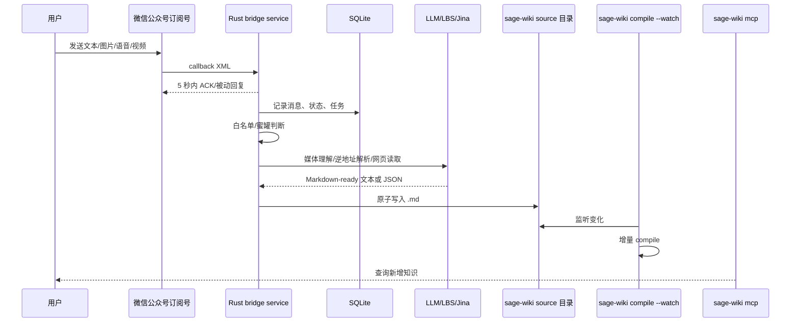

# sage-wiki 微信公众号桥接服务产品设计文档

语言: [English](product-design.en.md) | 中文

调研日期: 2026-05-27  
修订日期: 2026-05-27  
主约束: 独立项目, 目标 VPS 总内存 1.65GB, 本进程常态 RSS 低于 150MB, 上限 256MB。  
产品定位: 一个低资源常驻的微信公众号到 sage-wiki source 目录的桥接服务。

## 1. 背景

sage-wiki 的 `compile --watch` 可以监听本地 source 目录变化并增量编译。桥接服务负责接收微信公众号订阅号消息, 把用户发来的文本、图片、语音、视频转换成适合 sage-wiki 编译的 Markdown source, 从而让 `sage-wiki mcp` 尽快检索到新增信息。

目标链路:



## 2. 产品目标

- 白名单用户可以直接通过微信公众号把知识投递到 sage-wiki。
- 文本消息直接落为 Markdown source。
- 图片、语音、视频先保留原始文件, 再通过可配置模型转为可检索文本。
- 地理位置消息调用腾讯 LBS 逆地址解析, 保存原始坐标和逆地址 JSON。
- 链接消息调用 Jina Reader 获取页面 Markdown 内容, 用页面内容替换裸 URL 进入 source。
- 非白名单用户不触发媒体下载、LLM 调用和 source 写入, 只走蜜罐逻辑。
- 管理员可以通过只读后台查看所有接收消息、处理结果、错误和 source 路径。
- 服务必须适合小 VPS 常驻运行: 默认低并发、低内存、少依赖、可观测。

## 3. 关键调研结论

### 3.1 微信公众号约束

- 微信接入验证使用 GET callback, 参数包括 `signature`, `timestamp`, `nonce`, `echostr`。
- 用户消息通过 POST XML callback 到服务端, 使用 `MsgType` 区分七类普通消息: 文本、图片、语音、视频、小视频、地理位置、链接。
- 微信服务器要求服务快速响应。若 5 秒内未响应, 微信会断开并重试, 最多重试三次。因此 callback 不能同步等待媒体下载、LLM 调用、腾讯 LBS 或 Jina Reader。
- 图片、语音、视频 callback 只携带 `MediaId`, 原始媒体需要通过微信临时素材接口下载。
- `FromUserName` 是该用户在当前公众号下的 OpenID。UnionID 不是总能拿到, MVP 以 OpenID 作为白名单主体。

### 3.2 LLM 多模态约束

- OpenAI: 适合图片理解和语音转写。视频建议抽帧和音轨转写后处理。
- Anthropic: 适合图片理解。语音和视频需要桥接服务先做 ASR/抽帧。
- Gemini: 适合图片、音频、视频理解。视频直接理解优先考虑 Gemini。
- 图片、语音、视频分别配置为模型 A/B/C。A/B/C 可以来自不同 provider, 语音也可以使用专门 ASR 模型。

### 3.3 地理位置与链接处理约束

- 地理位置消息字段包含 `Location_X`, `Location_Y`, `Scale`, `Label`, `MsgId`。`Location_X` 是纬度 latitude, `Location_Y` 是经度 longitude。微信内置选点/定位来自腾讯地图体系, 坐标按腾讯地图原生 GCJ-02 处理。桥接服务必须直接调用腾讯位置服务 WebService 逆地址解析接口 `/ws/geocoder/v1/`, 不引入高德/百度坐标转换链路, 避免同为 GCJ-02 但底图和实现细节不同导致几十到几百米偏移。
- 链接消息字段包含 `Title`, `Description`, `Url`, `MsgId`。桥接服务保存原始 URL 和标题描述, 再调用 Jina Reader `https://r.jina.ai/<url>` 获取页面内容。最终 source 以页面内容为主, 原始 URL 作为元信息保留。

### 3.4 sage-wiki 约束

- 桥接服务不直接操作 sage-wiki 数据库。
- 桥接服务只向 sage-wiki 配置的 source 目录写 Markdown 文件。
- source 写入必须原子化, 避免 `compile --watch` 编译半成品文件。
- 原始 XML、原始媒体、LLM payload 不放进 sage-wiki source 目录, 避免被误编译。

参考资料:

- 微信公众号接入: https://developers.weixin.qq.com/doc/offiaccount/Basic_Information/Access_Overview.html
- 订阅号接收普通消息: https://developers.weixin.qq.com/doc/subscription/guide/product/message/Receiving_standard_messages.html
- 公众号接收普通消息: https://developers.weixin.qq.com/doc/offiaccount/Message_Management/Receiving_standard_messages.html
- 获取临时素材: https://developers.weixin.qq.com/doc/offiaccount/Asset_Management/Get_temporary_materials.html
- 微信网页授权: https://developers.weixin.qq.com/doc/offiaccount/OA_Web_Apps/Wechat_webpage_authorization.html
- OpenAI 图片理解: https://platform.openai.com/docs/guides/images-vision
- OpenAI 语音转文字: https://platform.openai.com/docs/guides/speech-to-text
- Anthropic Vision: https://docs.anthropic.com/en/docs/build-with-claude/vision
- Gemini 视频理解: https://ai.google.dev/gemini-api/docs/video-understanding
- 腾讯位置服务逆地址解析: https://lbs.qq.com/service/webService/webServiceGuide/webServiceGcoder
- Jina Reader: https://jina.ai/reader/

## 4. 用户角色

- 管理员: 部署服务、配置公众号、管理密钥、绑定白名单、查看后台列表和日志。
- 白名单用户: 给公众号发送内容, 让内容进入 sage-wiki。
- 非白名单用户: 给公众号发送消息时只收到蜜罐响应, 不消耗 LLM 额度。

## 5. MVP 范围

### 5.1 必做

- 微信 GET 接入验证。
- 微信 POST XML 接收、签名校验、幂等去重。
- 明文模式优先, 兼容/安全模式预留。
- 支持微信公众号普通消息七类: `text`, `image`, `voice`, `video`, `shortvideo`, `location`, `link`。
- 其他事件或非普通消息记录为 unsupported, 不做业务处理。
- SQLite 存储消息、任务、媒体、白名单、蜜罐事件、后台 session。
- 原始 XML、原始媒体、LLM 请求/响应按配置落盘。
- source Markdown 原子写入 sage-wiki source 目录。
- LLM provider 抽象, 支持图片模型 A、语音/ASR 模型 B、视频模型 C 分别配置。
- 腾讯 LBS 逆地址解析 client。
- Jina Reader client。
- 微信内带 key 绑定白名单。
- 后台只读列表和详情页, 支持分页、排序、搜索。
- 结构化日志。
- 业务逻辑单元测试。
- 常态内存控制: 默认配置下空闲 RSS 目标低于 80MB, 轻负载目标低于 150MB, 硬上限 256MB。

### 5.2 暂不做

- 多公众号租户。
- 复杂 RBAC。
- 后台写操作、人工编辑消息。
- 本地 OCR/ASR 模型。
- 主动客服消息通知。
- 对音乐、视频号、事件消息等非七类普通消息做深度处理。
- 内置启动或管理 `sage-wiki compile --watch`。

## 6. 核心功能

### 6.0 组件边界

桥接服务必须把接收、原始信息归档、预处理和结果保存拆成不同组件, 不允许在 callback handler 中混写业务处理。

组件职责:

- Message Receiver: 只负责微信签名校验、body size 限制、生成 request id、解析最小路由信息、快速 ACK。
- Raw Message Archive: 负责按配置保存 callback XML、解析后的 message JSON、媒体下载元信息和外部服务原始响应。普通日志只记录 raw path、hash、size; debug raw archive 开启时才保存完整原始内容。
- Pre-processor: 针对七类消息生成可进入知识库的中间结果。文本直通; 图片/语音/视频/小视频调用模型; 地理位置调用腾讯 LBS; 链接调用 Jina Reader。
- Processed Artifact Store: 保存 pre-processor 生成的文本、JSON、Markdown 片段和 source 草稿。
- Source Writer: 只负责把 processed artifact 原子写入 sage-wiki source 目录。

这条边界用于保证微信 callback 稳定、测试可拆分, 也避免 debug 归档策略影响业务预处理。

### 6.1 消息接收

服务提供:

- `GET /wechat/callback`: 微信 URL 验证。
- `POST /wechat/callback`: 接收微信消息 XML。

处理规则:

- callback 必须校验微信签名。
- request body 有大小限制。
- 原始 XML 先落盘, 再解析。
- 对 `MsgId` 做唯一约束。重复推送不重复创建 source。
- callback 同步阶段只做轻量逻辑: 签名校验、落盘、落库、白名单判断、入队、返回。

### 6.2 文本消息

文本消息不调用 LLM。

流程:

1. 保存原始 XML 和文本。
2. 判断白名单。
3. 白名单命中则生成 source Markdown。
4. 非白名单则进入蜜罐。

### 6.3 图片消息

流程:

1. 保存原始 XML 和 `MediaId`。
2. 白名单命中后创建异步任务。
3. worker 下载微信临时素材。
4. 保存图片原文件。
5. 调用配置的图片多模态模型 A。
6. 将 LLM 输出写入 Markdown source。

source 中保留:

- LLM 输出文本。
- 图片原始文件相对路径。
- 微信消息元信息。
- provider/model/处理时间。

### 6.4 语音消息

流程:

1. 下载语音临时素材。
2. 保存原始音频。
3. 如果微信 callback 有 `Recognition`, 保存为候选转写。
4. 调用配置的语音多模态模型 B 或专门 ASR 模型。
5. 可选再调用文本整理 prompt。
6. 写入 source。

默认 source 结构:

- 摘要。
- 逐字稿或近似逐字稿。
- 关键事实。
- 明确待办或想法。

### 6.5 视频消息

默认策略:

- 配置的视频多模态模型 C 支持 direct video 时, 优先直接视频理解。
- OpenAI/Anthropic 配置下, 使用 `ffmpeg` 抽关键帧和音轨, 再走图片理解和 ASR 汇总。
- `ffmpeg` 不可用时, 使用 `ThumbMediaId` 缩略图降级处理。

视频处理必须有更严格的资源保护:

- 限制最大下载文件大小。
- 限制抽帧数量。
- 限制同时处理视频任务数, 默认 1。
- LLM 超时和重试受全局配置约束。

### 6.6 小视频消息

小视频消息与视频消息同属媒体处理链路, 但在微信 XML 中 `MsgType` 为 `shortvideo`。

流程:

1. 保存原始 XML、`MediaId` 和 `ThumbMediaId`。
2. 用 `MediaId` 调微信临时素材接口下载小视频文件。
3. 用 `ThumbMediaId` 下载缩略图, 如果存在。
4. 保存原始视频和缩略图。
5. 后续按视频模型 C 处理, 或抽帧/音轨降级处理。
6. 写入 source。

### 6.7 地理位置消息

流程:

1. 保存 `Location_X`, `Location_Y`, `Scale`, `Label`, `MsgId`。
2. 白名单命中后创建异步任务。
3. 调用腾讯位置服务逆地址解析:

```text
https://apis.map.qq.com/ws/geocoder/v1/?location=<lat>,<lng>&key=<TENCENT_LBS_KEY>&get_poi=1
```

4. 近行政区边界时可配置 `radius=500` 等参数, 辅助腾讯 LBS 在附近范围内吸附到更合理的地址/行政区。
5. 保存腾讯 LBS 原始 JSON 到 raw 目录。
6. source 中以逆地址解析结果替代单纯坐标, 同时保留原始坐标、缩放级别和微信 Label。

防踩坑规则:

- `location=<lat>,<lng>`, 纬度在前、经度在后, 不允许写成 `lng,lat`。
- 腾讯 LBS key 必须启用 WebServiceAPI, 不是 JS SDK key。
- 服务端调用, key 只放后端环境变量, 不暴露到前端。
- 推荐在腾讯位置服务控制台给 key 配置服务器出口 IP 白名单。

source 内容建议:

- 原始坐标。
- 微信 Label。
- 逆地址解析 formatted address。
- 行政区划。
- `ad_info.adcode` 行政区划代码。
- POI 列表摘要。
- 原始 JSON 文件路径。

### 6.8 链接消息

流程:

1. 保存 `Title`, `Description`, `Url`, `MsgId`。
2. 白名单命中后创建异步任务。
3. 校验 URL scheme 只允许 `http` 和 `https`。
4. 调用 Jina Reader:

```text
https://r.jina.ai/<encoded_or_raw_url>
```

5. 保存 Reader 返回内容。
6. source 中用 Reader 页面内容替换 URL, 同时保留原始 URL、标题和描述。

source 内容建议:

- 原始标题。
- 原始描述。
- 原始 URL。
- Jina Reader 提取的页面 Markdown。
- Reader 调用时间和错误摘要。

### 6.9 原始数据保留

推荐目录:

```text
data/raw/2026/05/27/20260527T133015Z_7391827361827361827/
  callback.xml
  message.json
  text.txt
  media.original
  media.meta.json
  location.tencent-lbs.json
  link.jina-reader.md
  llm.request.json
  llm.response.json
  source.md
```

规则:

- 每条消息一个目录。
- 文件名前缀使用服务端接收时间戳。
- LLM/Jina/LBS payload 默认可保存, 但应允许关闭。
- 后台可查看路径和内容摘要。

### 6.10 sage-wiki source 写入

推荐路径:

```text
<sage_wiki_project>/raw/wechat/2026/05/20260527T133015Z_<msg_id_or_hash>.md
```

写入规则:

- 只写 Markdown。
- 先写 `.tmp`, flush 后 rename 为 `.md`。
- 同一 `MsgId` 目标路径稳定。
- source 写入成功后才标记 `source_written`。

### 6.11 白名单

MVP 使用 OpenID 白名单:

- `openid`: 明文保存于 SQLite, 仅服务内部使用。
- `openid_hash`: 日志和 UI 默认展示。
- `unionid`: 不作为必要条件。未认证订阅号网页授权不可用, 不依赖 OAuth 获取用户身份。

白名单未命中时:

- 不下载媒体。
- 不调用 LLM、腾讯 LBS 或 Jina Reader。
- 不写 source。
- 可按配置保存有限审计信息。

### 6.12 微信内白名单加入

未认证订阅号没有网页授权能力, 前端 JS-SDK 也不能直接获取 openid。因此白名单加入不走网页 OAuth, 改为 magic command:

1. 管理员通过 CLI 配置 `--whitelist-join-command`。
2. 用户给公众号发送完全匹配该 command 的文本消息。
3. receiver 从 callback XML 的 `FromUserName` 取得该用户在当前公众号下的 OpenID。
4. 服务将该 OpenID upsert 到白名单, source 为 `wechat-magic-command`。
5. command 消息入库留痕, 状态为 `whitelisted`, 不创建处理 job, 不写 sage-wiki source。

设计理由:

- 订阅号 callback 本身可靠携带 OpenID。
- 不依赖未认证订阅号不可用的网页授权。
- 不需要把鉴权 key 放进微信内链接或前端页面。
- magic command 通过 CLI 显式配置; 默认空值表示关闭自助加入。

### 6.13 用户 Command 与反馈规划

普通消息默认不逐条回复, 避免公众号刷屏。规划第一阶段只保留少量 command:

- `/new`: 结束当前 AI source 上下文, 下一条非 command 消息开启新 thread。
- `/status`: 返回最近处理摘要和失败情况。
- `/help`: 返回 command 简表。

白名单加入 command 仍由 `--whitelist-join-command` 单独配置, 不和上述 command 混用。

AI source 的 thread 边界默认按同一 OpenID 和 30 分钟窗口保守聚合, `/new` 是用户显式切分上下文的方式。详细格式见 [AI Source Format v1](ai-source-format.zh-CN.md)。

### 6.14 蜜罐逻辑

蜜罐目标是降低误用和滥用成本, 不是复杂风控系统。

配置项:

- 默认回复文本。
- 关键词回复。
- 是否保存非白名单正文。
- 每个 OpenID hash 的速率限制。
- 高频用户是否返回空串。

默认策略:

- 保存 openid hash、消息类型、时间、命中规则。
- 不保存非白名单媒体。
- 不调用外部 LLM、腾讯 LBS 或 Jina Reader。

### 6.14 只读后台

页面:

- `/admin/messages`: 消息列表。
- `/admin/messages/{id}`: 消息详情。

能力:

- 分页。
- 排序。
- 关键字搜索。
- 按状态、类型、是否白名单、provider、时间过滤。
- 查看原始 XML、解析字段、媒体路径、LLM/LBS/Jina 输出、source 内容、错误摘要。

认证:

- 浏览器: `/admin/login?key=...` 换取 HttpOnly session cookie。
- API: `Authorization: Bearer <admin_view_key>`。

## 7. 状态模型

消息状态:

- `received`: 已接收。
- `ignored`: unsupported 或非白名单。
- `queued`: 已入队。
- `processing`: worker 处理中。
- `media_downloaded`: 媒体已下载。
- `content_processed`: 文本直通、LLM、腾讯 LBS 或 Jina Reader 已处理。
- `source_written`: source 已写入。
- `failed`: 暂时失败, 可重试。
- `dead`: 重试耗尽。

## 8. 非功能需求

### 8.1 资源预算

默认部署目标:

- VPS 总内存: 1.65GB。
- 桥接进程硬预算: 256MB。
- 空闲 RSS 目标: 50-80MB。
- 轻负载 RSS 目标: 80-150MB。
- worker 默认并发: 1。
- 视频 worker 默认并发: 1。
- HTTP request body 限制: 2MB。
- 媒体下载大小默认限制: 100MB, 可调低。

因此主实现语言选择 Rust, 避免 GC 和较高运行时内存底座。

### 8.2 性能

- callback p95 小于 200ms。
- callback 不等待外部 LLM。
- 个人订阅号低频场景优先, 不为高 QPS 牺牲资源占用。

### 8.3 可靠性

- 幂等处理微信重试。
- SQLite 唯一约束防重复。
- 任务失败可重试。
- source 写入原子化。
- 媒体下载优先于 LLM, 避免临时素材过期。
- 地理位置和链接处理可排在媒体任务之后, 因为没有微信临时素材过期问题。

### 8.4 安全

- appid, appsecret, token, LLM key、腾讯 LBS key、Jina API key 放 `.env` 或系统 secret。
- 日志不输出 key、access_token、Authorization header。
- UI 默认展示 OpenID hash。
- 路径必须限制在配置目录内。

### 8.5 可观测性

结构化日志字段:

- `request_id`
- `message_id`
- `wechat_msg_id`
- `openid_hash`
- `job_id`
- `status`
- `provider`
- `external_service`
- `model`
- `source_path`
- `duration_ms`
- `error_kind`

## 9. 验收标准

- 微信接入验证通过。
- 文本消息在白名单命中后 1 秒内写入 source。
- 图片/语音/视频在 provider 可用时 1-3 分钟内写入 source。
- 地理位置消息在腾讯 LBS 可用时 10 秒内写入 source。
- 链接消息在 Jina Reader 可用时 30 秒内写入 source。
- 非白名单消息不产生 LLM、腾讯 LBS 或 Jina Reader 调用。
- 重复 callback 不产生重复 source。
- 后台可以搜索和查看详情。
- 默认配置下轻负载 RSS 低于 150MB。
- 业务逻辑测试覆盖签名、解析、白名单、蜜罐、任务状态机、source 生成。
