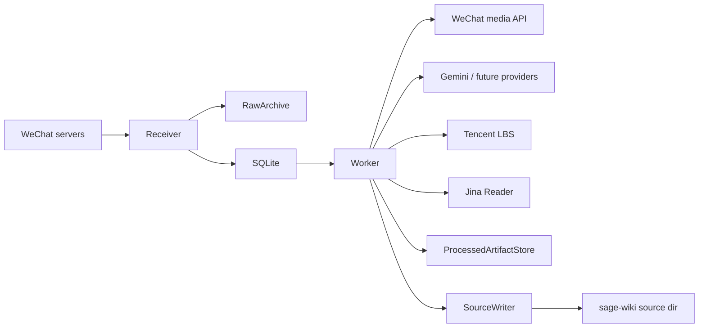

# sage-wiki WeChat Official Account Bridge Technical Design

Language: English | [中文](technical-design.zh-CN.md)

Research date: 2026-05-27  
Revision date: 2026-05-27  
Primary implementation: Rust + SQLite + local filesystem + async worker  
Target runtime: standalone binary running next to `sage-wiki compile --watch`  
Resource target: normal RSS below 150 MB, process budget up to 256 MB.

## 1. Overview

The bridge receives WeChat Official Account callbacks, verifies signatures, decrypts encrypted callbacks when enabled, persists raw input metadata, enforces whitelist rules, queues supported messages, and asynchronously writes Markdown source files for `sage-wiki`.

It is an independent project. It does not depend on `sage-wiki` internals and communicates with `sage-wiki` only through the configured source directory.

## 2. Design Principles

- Explicit runtime configuration: `CLI flags > --env-file > --use-process-env > built-in defaults`.
- Fast callback ACK: WeChat callback handlers must not block on media download, LLM calls, Tencent LBS, Jina Reader, or source writes.
- Clear boundaries: receiver, raw archive, preprocessor, processed artifact store, and source writer are separate components.
- Low resource usage: conservative SQLite pool, bounded media size, bounded HTTP timeouts, no heavyweight runtime dependencies.
- Operational clarity: structured logs, persistent job state, explicit retries, and inspectable file artifacts.
- Data recoverability: SQLite, raw archive, processed artifacts, and final source files are all backed by local filesystem paths.

## 3. Runtime Architecture



## 4. Main Modules

| Module | Responsibility |
| --- | --- |
| `config` | CLI/env-file/process-env merge, validation, runtime config. |
| `receiver` | WeChat GET verification, POST callback, signature/decryption, whitelist routing. |
| `wechat` | Message parsing, signature verification, OAuth, AES-CBC message crypto. |
| `store` | SQLite connection, migrations, messages, jobs, whitelist, list/detail queries. |
| `archive` | Raw payload metadata/full archive and processed artifact file writes. |
| `worker` | Job claiming, preprocessing, retries, source write state transitions. |
| `media` | WeChat access token and temporary media download. |
| `llm` | Gemini media processing client and provider interface. |
| `enrich` | Tencent LBS, Jina Reader, and HTTP safety checks. |
| `source` | Atomic Markdown source generation. |
| `admin` | Read-only message list/detail and whitelist join flow. |
| `health` | Health and readiness endpoints. |
| `telemetry` | JSON structured logging. |

## 5. Callback Handling

The receiver supports:

- Plain callback mode.
- Encrypted callback mode using WeChat AES-CBC message crypto.
- GET verification with `signature`, `timestamp`, `nonce`, and `echostr`.
- POST message callbacks with standard XML payloads.

Encrypted callbacks use WeChat's 32-byte PKCS#7 padding semantics. This differs from the AES block-size 16 PKCS#7 behavior exposed by common crypto crates, so padding is handled explicitly after AES-CBC decryption.

## 6. Message Processing

Callback path:

1. Verify signature.
2. Decrypt when encrypted callback mode is enabled.
3. Parse XML into a typed message.
4. Archive raw input according to archive settings.
5. Check whitelist.
6. Insert message record.
7. Create a job only for supported and authorized messages.
8. Return quickly to WeChat.

Worker path:

1. Claim the next pending job.
2. Load message data.
3. Run message-specific preprocessing:
   - text: direct Markdown body.
   - media: download media, call LLM provider.
   - location: call Tencent LBS.
   - link: call Jina Reader.
4. Save processed artifacts.
5. Write source atomically.
6. Mark job done or retry/failed.

## 7. Storage

SQLite stores durable state:

- whitelist subjects
- messages
- jobs
- source write state
- processing errors
- external artifact paths

Filesystem stores:

- raw archive under configured raw directory
- processed artifacts under configured processed directory
- final Markdown source under configured `sage-wiki` source directory

The source writer uses atomic write semantics to avoid `sage-wiki compile --watch` reading partial files.

## 8. Runtime Configuration

The binary does not load `.env` implicitly.

Configuration sources:

```text
CLI flags > --env-file PATH > --use-process-env > built-in defaults
```

Deployment should keep:

- operational knobs in CLI/systemd `ExecStart`
- secrets in an explicit env file loaded by `--env-file`
- process environment disabled unless intentionally used

Representative knobs include:

- bind address and callback/admin/health paths
- SQLite URL and pool size
- raw/processed/source directories
- request body limit
- worker interval, timeout, retry backoff, worker id, bridge version
- WeChat API base, callback mode, token refresh skew
- Gemini/Tencent LBS/Jina endpoints and limits
- admin pagination and keys

## 9. External Services

| Service | Use |
| --- | --- |
| WeChat API | access token and temporary media download |
| Gemini | image, voice, video, and short video media understanding |
| Tencent LBS | reverse geocoding for WeChat location messages |
| Jina Reader | converting link URLs into Markdown-like page content |

Location handling uses Tencent LBS directly because WeChat location messages are already in the Tencent/GCJ-02 ecosystem.

## 10. Logging

Logs are JSON structured logs using `tracing`. Normal logs should contain metadata, hashes, paths, status changes, and error kinds. Raw payload content should be stored in archive files, not printed into ordinary logs.

Log filter is controlled by `--rust-log`.

## 11. Reliability and Recovery

Jobs are persisted in SQLite. Failed jobs are retried with configurable exponential backoff. Stale processing jobs can be requeued after a configurable timeout.

Recovery depends on restoring:

- SQLite database
- raw archive
- processed artifacts
- generated source files, or enough state to regenerate them

The service should be restarted under systemd with memory limits appropriate for the target VPS.

## 12. Testing

The implementation includes tests for:

- WeChat signature and encrypted callback crypto
- all supported message parsers
- receiver whitelist and honeypot behavior
- SQLite job state transitions
- worker processing paths
- media download and LLM mock handling
- Tencent LBS and Jina Reader clients
- source writer atomic output
- admin and health endpoints
- explicit configuration precedence

Recorded WeChat callback replay is used as an integration regression check.

## 13. Deployment Notes

Systemd templates are under `deploy/systemd`.

Before deployment, review:

- `--database-url`
- `--raw-archive-dir`
- `--processed-artifact-dir`
- `--sage-wiki-source-dir`
- `--wechat-callback-path`
- `ReadWritePaths`
- `MemoryMax`

Use `/healthz` for liveness and `/readyz` for database readiness unless overridden by CLI flags.

## 14. Related Documents

- [English README](../README.md)
- [中文 README](../README.zh-CN.md)
- [English Product Design / PRD](product-design.en.md)
- [中文技术设计](technical-design.zh-CN.md)

