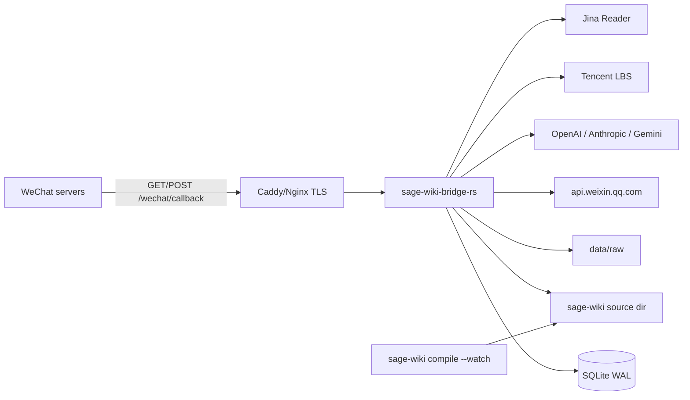
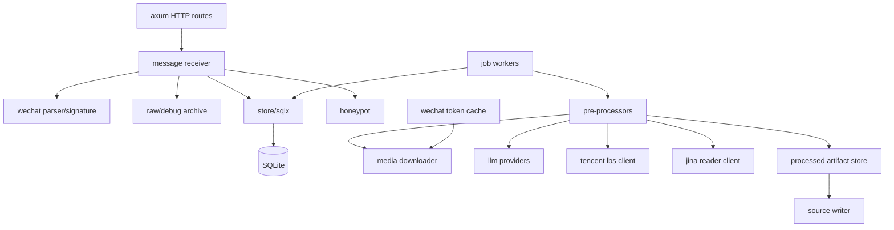
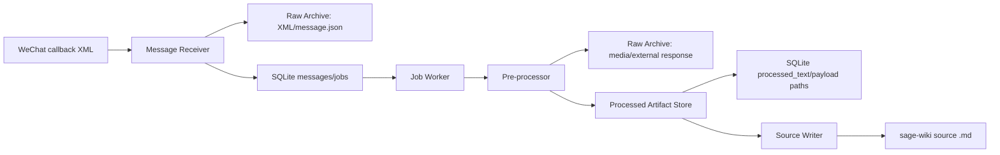
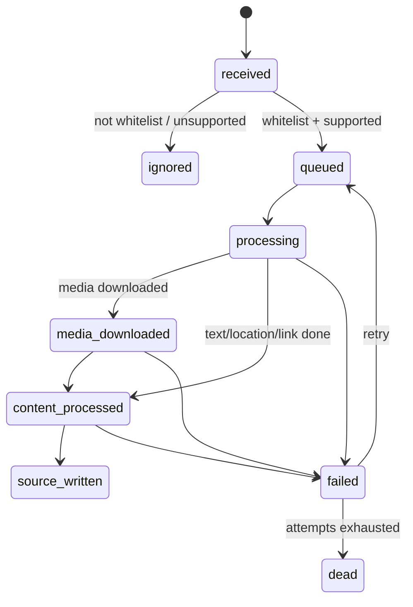

# sage-wiki 微信公众号桥接服务详细技术设计文档

语言: [English](technical-design.en.md) | 中文

调研日期: 2026-05-27  
修订日期: 2026-05-27  
主技术路线: Rust + SQLite + 本地文件系统 + 异步 worker  
目标运行方式: 独立二进制, 与 `sage-wiki compile --watch` 并行运行。  
资源目标: 常态 RSS 低于 150MB, 进程内存预算上限 256MB。

## 0. 概述及背景

### 0.1 项目背景

微信公众号订阅号适合作为低摩擦的信息入口。用户在微信里发送文本、图片、语音、视频、小视频、地理位置或链接后, 微信公众号后台会把消息转发到配置的 callback URL。桥接服务负责接收这些 callback, 经过白名单、蜜罐、预处理和归档后, 将可检索的 Markdown source 写入 sage-wiki 的 source 目录。随后 `sage-wiki compile --watch` 监听文件变化并增量编译, `sage-wiki mcp` 即时提供新增知识。

本服务不是 sage-wiki 子项目, 不复用 sage-wiki 内部代码和配置体系。它是一个独立常驻进程, 通过本地文件系统与 sage-wiki 解耦。

### 0.2 项目目标

- 接收微信公众号普通消息七类: text、image、voice、video、shortvideo、location、link。
- 对白名单用户的消息生成可进入 sage-wiki 的 Markdown source。
- 对非白名单用户只执行蜜罐逻辑, 不调用外部 LLM、腾讯 LBS 或 Jina Reader。
- 原始输入、外部响应、预处理产物和最终 source 分层保存, 便于审计和恢复。
- 在 1.65GB VPS 上常驻运行, 本进程轻负载 RSS 低于 150MB, 硬上限 256MB。
- 提供只读后台, 用于查看消息、处理结果、错误和 source 路径。

### 0.3 用户与使用方

- 管理员: 部署服务、配置微信公众号、管理密钥、绑定白名单、查看后台和日志。
- 白名单用户: 在微信中发送消息, 让内容进入 sage-wiki。
- 非白名单用户: 发送消息时只收到蜜罐响应, 不触发真实处理流程。
- sage-wiki: 不是调用方, 只通过 source 目录感知桥接服务写入的 Markdown 文件。

### 0.4 核心约束

- 微信 callback 必须快速响应, 不能同步执行媒体下载、LLM 调用、腾讯 LBS、Jina Reader 或 source 写入。
- 原始消息保存、预处理、预处理产物保存、source 写入必须是独立组件。
- 所有外部密钥只能来自环境变量或 secret manager, 不进入 SQLite 明文字段或普通日志。
- 地理位置坐标按微信/腾讯地图 GCJ-02 处理, `Location_X=latitude`, `Location_Y=longitude`, 直接调用腾讯 LBS。

## 1. 技术选型结论

### 1.1 选择 Rust

在本项目的新前提下, 推荐 Rust 作为主实现语言。

决定性原因:

- 目标 VPS 只有 1.65GB 内存, 本服务最好常态低于 150MB, 最多 256MB。Rust 无 GC, 运行时底座更低, 更容易稳定压住 RSS。
- 项目是独立桥接服务, 不需要遵循 sage-wiki 的 Go 代码风格、配置体系或包结构。
- 服务长期常驻, 但业务低频。Rust 的静态二进制、强类型状态机和显式资源控制更适合小 VPS。
- 微信 callback、任务状态机、白名单、source 写入这类业务边界可以用 Rust enum/newtype 更强地约束。
- 相比 Go, Rust 可以避免 GC 带来的不可控内存增长和 STW 抖动, 尤其在视频/图片 buffer、JSON payload、HTTP body 同时存在时更稳。

Go 仍然可行, 但在这个约束下不再是首选。Go 的优势主要是开发速度和生态样例; Rust 的优势更贴近当前部署目标。

### 1.2 推荐技术栈

| 领域 | 选择 | 理由 |
| --- | --- | --- |
| HTTP server | `axum` | 基于 tower, 生态成熟, 类型化 handler 清晰 |
| async runtime | `tokio` | Rust 标准事实运行时 |
| SQLite | `sqlx` + `sqlite` | 编译期 SQL 检查可选, async API 成熟 |
| migration | `sqlx::migrate!` | 少引入工具, 直接随二进制发布 |
| HTTP client | `reqwest` with `rustls` | 调微信、LLM provider、腾讯 LBS、Jina Reader |
| XML | `quick-xml` + `serde` | 低内存 streaming XML |
| JSON | `serde`, `serde_json` | 标准选择 |
| config | `figment` 或 `config` + `dotenvy` | YAML + env |
| logging | `tracing`, `tracing-subscriber` | 结构化日志 |
| templates | `askama` | 编译期模板, 后台只读页面足够 |
| time | `time` 或 `chrono` | 推荐 `time`, 依赖较轻 |
| crypto | `sha1`, `sha2`, `hmac`, `constant_time_eq` | 微信签名、hash、state |
| temp/atomic write | `tempfile` + `persist`/rename | source 原子写入 |

`Cargo.toml` 依赖应克制, 默认不引入大型框架、ORM、浏览器资产构建链。

### 1.3 运行时策略

为了控制内存:

- `tokio` 使用 multi-thread runtime, worker threads 默认 2。
- 阻塞任务通过 `spawn_blocking`, 但限制 blocking 任务数量。
- LLM worker 默认并发 1。
- 视频任务默认并发 1。
- HTTP body 使用 size limit。
- 下载媒体优先流式写入文件, 不整文件读入内存。
- LLM 请求中图片/音频如需 base64, 设置尺寸上限; 大文件走 provider file upload API 或降级。

推荐环境变量:

```bash
MALLOC_ARENA_MAX=2
RUST_LOG=info,sage_wiki_bridge=debug
```

如目标 Linux 允许, 发布 musl 或 glibc 版本都可以。优先 glibc + rustls, 便于 SQLite 和 TLS 稳定。

## 2. 架构



进程内部:



组件边界:

- `message receiver`: 微信协议边界。只做签名校验、body 限制、request id、最小解析、幂等入库、白名单/蜜罐分流和 ACK。
- `raw/debug archive`: 原始数据归档边界。保存 callback XML、解析 JSON、媒体元信息、外部服务原始响应。普通日志只记录文件路径/hash/size; 完整原始内容只在显式开启 debug raw archive 时保存到文件, 不直接写入 stdout 日志。
- `pre-processors`: 内容预处理边界。按消息类型调用 text/image/voice/video/shortvideo/location/link 处理器, 输出统一 `ProcessedArtifact`。
- `processed artifact store`: 中间产物边界。保存 LLM 文本、腾讯 LBS JSON 摘要、Jina Reader Markdown、source draft, 并更新 `processed_text`/payload path。
- `source writer`: sage-wiki 边界。只读取 processed artifact, 原子写入 source 目录, 不调用微信、LLM、LBS 或 Jina。

### 2.1 设计理念

- 解耦优先: 微信 receiver、raw archive、pre-processor、artifact store、source writer 分离, 每层只处理自己的边界。
- 快速 ACK: callback 链路只做轻量同步工作, 慢操作全部异步。
- 文件系统为集成边界: 不直接操作 sage-wiki 数据库, 只写 Markdown source。
- 小内存优先: 用 Rust、流式下载、低并发 worker、SQLite 本地存储, 避免常驻队列中间件。
- 可恢复优先: 原始输入和预处理产物可落盘, DB 中记录状态和路径, 失败任务可重试或人工恢复。
- 可观测优先: 所有跨组件边界记录 request id、message id、job id、path、hash 和耗时。

### 2.2 资源与权衡原则

- 本机资源约束优先于吞吐量。默认 job worker 为 1, 视频 worker 为 1。
- SQLite 优先于 PostgreSQL/Redis, 牺牲横向扩展能力, 换取低运维和低内存。
- server-rendered admin 优先于 SPA, 牺牲交互丰富度, 换取无前端构建链和更低资源占用。
- 外部服务失败优先保持可重试状态, 不在 callback 中暴露复杂错误。
- debug 原始归档优先落文件而不是打日志, 防止敏感内容进入 stdout、journald 或第三方日志系统。

## 3. 目录结构

建议:

```text
sage-wiki-bridge-wxo/
  Cargo.toml
  Cargo.lock
  migrations/
    0001_init.sql
  config.example.yaml
  prompts/
    image.md
    voice.md
    video.md
  src/
    main.rs
    app.rs
    config.rs
    error.rs
    routes/
      mod.rs
      wechat.rs
      admin.rs
      bind.rs
    receiver/
      mod.rs
      callback.rs
      raw_archive.rs
    wechat/
      mod.rs
      signature.rs
      xml.rs
      client.rs
      oauth.rs
    auth/
      mod.rs
      whitelist.rs
      session.rs
      state.rs
    store/
      mod.rs
      models.rs
      repo.rs
      migrations.rs
    queue/
      mod.rs
      worker.rs
      state.rs
    preprocess/
      mod.rs
      text.rs
      image.rs
      voice.rs
      video.rs
      location.rs
      link.rs
      artifact.rs
    llm/
      mod.rs
      openai.rs
      anthropic.rs
      gemini.rs
      capability.rs
    enrich/
      mod.rs
      tencent_lbs.rs
      jina_reader.rs
    media/
      mod.rs
      detect.rs
      ffmpeg.rs
    source/
      mod.rs
      markdown.rs
      atomic.rs
    admin/
      templates/
        messages.html
        message_detail.html
    telemetry.rs
```

## 4. 配置

当前实现不隐式加载 `.env`。配置来源顺序为:

```text
CLI flags > --env-file PATH > --use-process-env > built-in defaults
```

运行时检查命令:

- `--version`: 打印 package version 后退出。
- `version`: `--version` 的指令形式。
- `-V`: 打印 package version、构建目标、解析后的配置值和每个值的来源, 不启动监听器或 worker。
- `status`: 读取配置指向的 SQLite 数据库, 打印解析后的配置和 message/job 聚合计数。provider token 用量目前尚未持久化, 输出为 `not_tracked`。
- systemd 打包部署使用 `scripts/bridgectl.sh`, 让 `run`、`-V`、`status` 共用 `/etc/sage-wiki-bridge.env` 的参数展开逻辑。

### 4.1 `.env`

密钥只放环境变量或 `.env`:

```bash
BRIDGE_CONFIG=./config.yaml
BRIDGE_HTTP_ADDR=127.0.0.1:18090

WECHAT_APP_ID=wx...
WECHAT_APP_SECRET=...
WECHAT_TOKEN=...
WECHAT_ENCODING_AES_KEY=...

ADMIN_VIEW_KEY=...

OPENAI_API_KEY=...
ANTHROPIC_API_KEY=...
GEMINI_API_KEY=...
TENCENT_LBS_KEY=...
JINA_API_KEY=...
```

规则:

- `.env` 不进 Git。
- key 不写 SQLite。
- 日志只打印 key 是否配置, 不打印值。

### 4.2 `config.yaml`

```yaml
server:
  public_base_url: "https://bridge.example.com"
  listen_addr: "127.0.0.1:18090"
  read_timeout_seconds: 5
  write_timeout_seconds: 5
  request_body_limit_bytes: 2097152

runtime:
  tokio_worker_threads: 2
  job_workers: 1
  video_workers: 1
  channel_buffer: 32

storage:
  sqlite_path: "./data/bridge.sqlite"
  raw_dir: "./data/raw"
  processed_dir: "./data/processed"
  debug_raw_archive: false
  save_llm_payloads: true
  hash_openid_in_ui: true

limits:
  max_media_bytes: 104857600
  max_image_bytes_for_inline_llm: 10485760
  max_video_frames: 8
  llm_timeout_seconds: 120
  wechat_http_timeout_seconds: 20
  tencent_lbs_timeout_seconds: 10
  jina_reader_timeout_seconds: 30
  max_jina_response_bytes: 5242880

sage_wiki:
  source_dir: "/srv/wiki/raw/wechat"
  source_timezone: "Asia/Shanghai"
  filename_template: "{{received_utc}}_{{msg_id_or_hash}}.md"

wechat:
  callback_path: "/wechat/callback"
  message_mode: "plain"
  passive_reply_whitelist: ""
  passive_reply_unsupported: ""

auth:
  bind_key_ttl_minutes: 30
  admin_session_ttl_hours: 12

honeypot:
  enabled: true
  default_reply: "已收到。"
  store_non_whitelist_text: false
  rate_limit_per_openid_per_hour: 20
  keyword_replies:
    "合作": "请发送邮件联系。"

llm:
  max_retries: 3
  image:
    provider: "openai"
    model: "configured-vision-model"
    prompt_file: "./prompts/image.md"
  voice:
    provider: "openai"
    transcription_model: "configured-transcription-model"
    prompt_file: "./prompts/voice.md"
  video:
    provider: "gemini"
    model: "configured-video-model"
    prompt_file: "./prompts/video.md"
    ffmpeg_path: "ffmpeg"
    fallback_to_thumb: true

enrich:
  location:
    provider: "tencent_lbs"
    endpoint: "https://apis.map.qq.com/ws/geocoder/v1/"
    get_poi: true
  link:
    provider: "jina_reader"
    endpoint: "https://r.jina.ai/"
    response_format: "markdown"
    save_response: true

logging:
  level: "info"
  format: "json"
```

## 5. HTTP 接口

### 5.1 微信 callback

`GET /wechat/callback`

Query:

- `signature`
- `timestamp`
- `nonce`
- `echostr`

处理:

1. 读取 query。
2. `sha1(sort(token, timestamp, nonce).join(""))`。
3. 常量时间比较。
4. 成功返回 `echostr`, 失败返回 403。

`POST /wechat/callback`

同步处理:

1. 生成 `request_id`。
2. 校验微信签名。
3. 限制 body size。
4. Receiver 将原始 XML 交给 Raw Archive。Raw Archive 根据 `storage.debug_raw_archive` 决定是否保存完整 XML, 但始终返回 raw path/hash/size 供日志和 DB 记录。
5. `quick-xml` 解析为强类型消息 enum。
6. SQLite transaction: upsert message, 判断去重, 判断白名单, 创建 job 或 honeypot event。
7. job 只记录待执行 pre-processor, 不在 callback 内执行预处理。
8. 返回空串或被动回复 XML。

同步阶段禁止:

- 下载媒体。
- 调 LLM。
- 调腾讯 LBS。
- 调 Jina Reader。
- 写 sage-wiki source。
- 保存 pre-processor 输出。
- 等待 ffmpeg。

### 5.2 微信内白名单加入

未认证订阅号不支持网页授权, 前端 JS-SDK 也不能直接获取 openid。因此白名单加入走消息 callback:

- 配置 `--whitelist-join-command`。
- 用户给公众号发送完全匹配该 command 的文本消息。
- receiver 使用 callback XML 中的 `FromUserName` 作为 OpenID。
- upsert 白名单, source 记录为 `wechat-magic-command`。
- command 消息状态为 `whitelisted`, 不创建处理 job。
- 展示绑定结果。

### 5.3 后台页面和 API

页面:

- `GET /admin/login?key=...`
- `GET /admin/messages`
- `GET /admin/messages/:id`

API:

- `GET /api/admin/messages`
- `GET /api/admin/messages/:id`

认证:

- 浏览器登录只在 `/admin/login` 接受 query key, 成功后设置 HttpOnly session cookie 并跳转。
- API 只接受 `Authorization: Bearer <ADMIN_VIEW_KEY>`。

## 6. Rust 类型设计

### 6.1 微信消息

```rust
pub enum IncomingMessage {
    Text(TextMessage),
    Image(ImageMessage),
    Voice(VoiceMessage),
    Video(VideoMessage),
    ShortVideo(VideoMessage),
    Location(LocationMessage),
    Link(LinkMessage),
    Unsupported(UnsupportedMessage),
}

pub struct CommonFields {
    pub to_user_name: String,
    pub from_user_name: OpenId,
    pub create_time: i64,
    pub msg_id: Option<WechatMsgId>,
}

pub struct TextMessage {
    pub common: CommonFields,
    pub content: String,
}

pub struct ImageMessage {
    pub common: CommonFields,
    pub pic_url: Option<String>,
    pub media_id: MediaId,
}

pub struct VoiceMessage {
    pub common: CommonFields,
    pub media_id: MediaId,
    pub format: Option<String>,
    pub recognition: Option<String>,
}

pub struct VideoMessage {
    pub common: CommonFields,
    pub media_id: MediaId,
    pub thumb_media_id: Option<MediaId>,
}

pub struct LocationMessage {
    pub common: CommonFields,
    pub latitude: f64,  // Location_X
    pub longitude: f64, // Location_Y
    pub scale: Option<i32>,
    pub label: Option<String>,
}

pub struct LinkMessage {
    pub common: CommonFields,
    pub title: Option<String>,
    pub description: Option<String>,
    pub url: Url,
}
```

使用 newtype 避免把 OpenID、MsgID、MediaID 混用:

```rust
pub struct OpenId(String);
pub struct WechatMsgId(String);
pub struct MediaId(String);
pub struct OpenIdHash(String);
pub struct TencentLbsKey(String);
pub struct JinaApiKey(String);
```

### 6.2 预处理产物

所有消息类型的 pre-processor 都输出统一产物, Source Writer 只消费该产物, 不关心具体外部服务。

```rust
pub enum ProcessedArtifactKind {
    Text,
    Image,
    Voice,
    Video,
    ShortVideo,
    Location,
    Link,
}

pub struct ProcessedArtifact {
    pub message_id: i64,
    pub kind: ProcessedArtifactKind,
    pub markdown_body: String,
    pub summary: Option<String>,
    pub raw_payload_paths: Vec<PathBuf>,
    pub processed_payload_paths: Vec<PathBuf>,
    pub provider: Option<String>,
    pub model: Option<String>,
    pub external_service: Option<String>,
}
```

保存规则:

- Raw Archive 保存原始输入: XML、微信字段 JSON、媒体原文件、外部服务原始响应。
- Pre-processor 生成并保存处理后产物: LLM 文本、ASR 转写、腾讯 LBS 摘要、Jina Reader Markdown、source draft。
- Source Writer 只读取 `ProcessedArtifact.markdown_body` 和元数据, 生成最终 `.md`。

### 6.3 状态枚举

```rust
#[derive(sqlx::Type, Debug, Clone, Copy, PartialEq, Eq)]
#[sqlx(type_name = "TEXT")]
pub enum MessageStatus {
    Received,
    Ignored,
    Queued,
    Processing,
    MediaDownloaded,
    ContentProcessed,
    SourceWritten,
    Failed,
    Dead,
}

#[derive(sqlx::Type, Debug, Clone, Copy, PartialEq, Eq)]
#[sqlx(type_name = "TEXT")]
pub enum JobStatus {
    Pending,
    Processing,
    Done,
    Failed,
    Dead,
}
```

状态转换集中放在 `queue::state`, 不允许 handler 随意写字符串状态。

## 7. 数据库设计

SQLite 初始化:

```sql
PRAGMA journal_mode = WAL;
PRAGMA foreign_keys = ON;
PRAGMA busy_timeout = 5000;
PRAGMA synchronous = NORMAL;
```

### 7.1 `messages`

```sql
CREATE TABLE messages (
  id INTEGER PRIMARY KEY AUTOINCREMENT,
  request_id TEXT NOT NULL,
  wechat_msg_id TEXT,
  to_user_name TEXT NOT NULL,
  from_openid TEXT NOT NULL,
  from_openid_hash TEXT NOT NULL,
  unionid TEXT,
  create_time INTEGER,
  received_at TEXT NOT NULL,
  message_type TEXT NOT NULL,
  content_text TEXT,
  media_id TEXT,
  thumb_media_id TEXT,
  pic_url TEXT,
  voice_format TEXT,
  voice_recognition TEXT,
  location_lat REAL,
  location_lng REAL,
  location_scale INTEGER,
  location_label TEXT,
  link_title TEXT,
  link_description TEXT,
  link_url TEXT,
  authorized INTEGER NOT NULL DEFAULT 0,
  status TEXT NOT NULL,
  raw_dir TEXT NOT NULL,
  source_path TEXT,
  processed_text TEXT,
  enrichment_json_path TEXT,
  reader_content_path TEXT,
  provider TEXT,
  model TEXT,
  error_kind TEXT,
  error_message TEXT,
  processed_at TEXT,
  created_at TEXT NOT NULL,
  updated_at TEXT NOT NULL
);

CREATE UNIQUE INDEX idx_messages_wechat_msg_id
ON messages(wechat_msg_id)
WHERE wechat_msg_id IS NOT NULL AND wechat_msg_id != '';

CREATE INDEX idx_messages_received_at ON messages(received_at);
CREATE INDEX idx_messages_status ON messages(status);
CREATE INDEX idx_messages_type ON messages(message_type);
CREATE INDEX idx_messages_openid_hash ON messages(from_openid_hash);
CREATE INDEX idx_messages_link_url ON messages(link_url);
```

### 7.2 `media_assets`

```sql
CREATE TABLE media_assets (
  id INTEGER PRIMARY KEY AUTOINCREMENT,
  message_id INTEGER NOT NULL REFERENCES messages(id) ON DELETE CASCADE,
  media_id TEXT NOT NULL,
  kind TEXT NOT NULL,
  local_path TEXT NOT NULL,
  content_type TEXT,
  file_ext TEXT,
  size_bytes INTEGER,
  sha256 TEXT,
  download_status TEXT NOT NULL,
  error_message TEXT,
  created_at TEXT NOT NULL
);

CREATE INDEX idx_media_message_id ON media_assets(message_id);
CREATE INDEX idx_media_sha256 ON media_assets(sha256);
```

### 7.3 `external_payloads`

用于保存非 LLM 的外部增强结果, 例如腾讯 LBS JSON 和 Jina Reader 页面内容。

```sql
CREATE TABLE external_payloads (
  id INTEGER PRIMARY KEY AUTOINCREMENT,
  message_id INTEGER NOT NULL REFERENCES messages(id) ON DELETE CASCADE,
  service TEXT NOT NULL, -- tencent_lbs | jina_reader
  request_url TEXT,
  local_path TEXT NOT NULL,
  content_type TEXT,
  status_code INTEGER,
  size_bytes INTEGER,
  sha256 TEXT,
  error_message TEXT,
  created_at TEXT NOT NULL
);

CREATE INDEX idx_external_payloads_message_id ON external_payloads(message_id);
CREATE INDEX idx_external_payloads_service ON external_payloads(service);
```

### 7.4 `jobs`

```sql
CREATE TABLE jobs (
  id INTEGER PRIMARY KEY AUTOINCREMENT,
  message_id INTEGER NOT NULL REFERENCES messages(id) ON DELETE CASCADE,
  job_type TEXT NOT NULL,
  status TEXT NOT NULL,
  attempts INTEGER NOT NULL DEFAULT 0,
  max_attempts INTEGER NOT NULL DEFAULT 3,
  next_run_at TEXT NOT NULL,
  locked_at TEXT,
  locked_by TEXT,
  last_error TEXT,
  created_at TEXT NOT NULL,
  updated_at TEXT NOT NULL
);

CREATE INDEX idx_jobs_claim ON jobs(status, next_run_at);
CREATE UNIQUE INDEX idx_jobs_one_process_per_message
ON jobs(message_id, job_type);
```

### 7.5 `whitelist_subjects`

```sql
CREATE TABLE whitelist_subjects (
  id INTEGER PRIMARY KEY AUTOINCREMENT,
  openid TEXT NOT NULL UNIQUE,
  openid_hash TEXT NOT NULL,
  unionid TEXT,
  label TEXT,
  source TEXT NOT NULL,
  enabled INTEGER NOT NULL DEFAULT 1,
  first_bound_at TEXT NOT NULL,
  last_seen_at TEXT,
  created_at TEXT NOT NULL,
  updated_at TEXT NOT NULL
);
```

### 7.6 `auth_grants`, `honeypot_events`, `admin_sessions`

```sql
CREATE TABLE auth_grants (
  id INTEGER PRIMARY KEY AUTOINCREMENT,
  nonce TEXT NOT NULL UNIQUE,
  purpose TEXT NOT NULL,
  expires_at TEXT NOT NULL,
  used_at TEXT,
  created_at TEXT NOT NULL
);

CREATE TABLE honeypot_events (
  id INTEGER PRIMARY KEY AUTOINCREMENT,
  message_id INTEGER REFERENCES messages(id) ON DELETE SET NULL,
  openid_hash TEXT NOT NULL,
  message_type TEXT NOT NULL,
  rule_name TEXT,
  reply_text TEXT,
  stored_text INTEGER NOT NULL DEFAULT 0,
  created_at TEXT NOT NULL
);

CREATE TABLE admin_sessions (
  id INTEGER PRIMARY KEY AUTOINCREMENT,
  session_id_hash TEXT NOT NULL UNIQUE,
  expires_at TEXT NOT NULL,
  created_at TEXT NOT NULL,
  last_seen_at TEXT
);
```

### 7.7 数据流转



流转规则:

- Receiver 只写 raw archive 元信息和 DB 初始状态。
- Pre-processor 读取 DB job 和 raw paths, 生成 `ProcessedArtifact`。
- Processed Artifact Store 保存中间产物路径, 并更新 `messages.processed_text`、`external_payloads`、`media_assets`。
- Source Writer 读取 artifact, 原子写入 source, 再更新 `messages.source_path` 和 `status=source_written`。
- DB 是状态真源, 文件系统是 payload 真源。DB 中存路径、hash、size 和状态, 大 payload 不直接塞进 SQLite。

### 7.8 数据存储与保留

- SQLite: 存消息索引、状态、任务、白名单、session、payload 路径和错误摘要。
- `data/raw`: 存 callback XML、message JSON、媒体原文件、外部服务原始响应。
- `data/processed`: 存 pre-processor 产物, 包括 LLM 文本、ASR 转写、LBS 摘要、Jina Markdown、source draft。
- sage-wiki source 目录: 只存最终 Markdown source, 按 `received_at` 日期写入 `YYYY-MM-DD.md`。
- 默认不自动删除 raw/processed 数据。后续可增加 retention policy, 但 MVP 先保证可审计和可恢复。

### 7.9 缓存设计

- 微信 `access_token`: 进程内缓存, 过期前 300 秒刷新; 失败时不污染旧 token。
- 腾讯 LBS/Jina/LLM 响应: MVP 不做内存缓存, 只通过 raw/processed 文件和 DB 路径实现结果复用。
- 白名单: 默认每次查 SQLite; 如后续需要可加短 TTL in-memory cache, 但更新白名单后必须可主动失效。
- Admin session: SQLite 持久化, session id 只存 hash。

## 8. 任务状态机



claim job SQL:

```sql
UPDATE jobs
SET status = 'processing',
    locked_at = CURRENT_TIMESTAMP,
    locked_by = ?,
    attempts = attempts + 1,
    updated_at = CURRENT_TIMESTAMP
WHERE id = (
  SELECT id FROM jobs
  WHERE status = 'pending'
    AND next_run_at <= CURRENT_TIMESTAMP
  ORDER BY next_run_at ASC, id ASC
  LIMIT 1
)
RETURNING *;
```

重试:

- 30 秒。
- 2 分钟。
- 10 分钟。
- 超过 `max_attempts` 进入 `dead`。

## 9. 微信客户端

### 9.1 access_token

接口:

```text
GET https://api.weixin.qq.com/cgi-bin/token?grant_type=client_credential&appid=APPID&secret=APPSECRET
```

实现:

- 进程内 `RwLock<Option<TokenState>>` 缓存。
- 过期前 300 秒刷新。
- token 刷新失败不 panic, 返回可重试错误。
- 多 worker 同时刷新时使用 mutex 防止 thundering herd。

### 9.2 临时素材下载

接口:

```text
GET https://api.weixin.qq.com/cgi-bin/media/get?access_token=ACCESS_TOKEN&media_id=MEDIA_ID
```

实现:

- `reqwest` stream response body。
- 逐 chunk 写入临时文件。
- 同时计算 sha256 和累计 size。
- 超过 `max_media_bytes` 立即中断并标记失败。
- 根据 `Content-Type` 和文件头确定扩展名。

## 10. LLM provider 设计

### 10.1 trait

```rust
#[async_trait::async_trait]
pub trait LlmProvider: Send + Sync {
    fn name(&self) -> &'static str;
    fn capabilities(&self) -> ProviderCapabilities;

    async fn process_image(&self, req: ImageRequest) -> Result<ProcessedResult, LlmError>;
    async fn process_voice(&self, req: VoiceRequest) -> Result<ProcessedResult, LlmError>;
    async fn process_video(&self, req: VideoRequest) -> Result<ProcessedResult, LlmError>;
}

pub struct ProviderCapabilities {
    pub image: bool,
    pub voice: bool,
    pub direct_video: bool,
    pub file_upload: bool,
}
```

如果希望避免 `async_trait` 带来的 box future, 可以后续改为显式 `impl Future`; MVP 可接受 `async_trait`, 因为并发很低。

### 10.2 provider 策略

| 消息类型 | OpenAI | Anthropic | Gemini | MVP 推荐 |
| --- | --- | --- | --- | --- |
| text | 不需要 | 不需要 | 不需要 | 直接写 source |
| image | 支持, 模型 A 可配置 | 支持, 模型 A 可配置 | 支持, 模型 A 可配置 | OpenAI 或 Gemini |
| voice | 支持 ASR, 模型 B 可配置 | 需外部 ASR | 支持音频, 模型 B 可配置 | OpenAI ASR 或 Gemini |
| video | 抽帧+ASR, 模型 C 可配置 | 抽帧+ASR, 模型 C 可配置 | 直接视频理解, 模型 C 可配置 | Gemini |
| shortvideo | 同 video | 同 video | 同 video | Gemini 或抽帧降级 |
| location | 不适用 | 不适用 | 不适用 | 腾讯 LBS |
| link | 不适用 | 不适用 | 不适用 | Jina Reader |

### 10.3 payload 保存

如果 `storage.save_llm_payloads = true`:

- 保存脱敏后的 request JSON。
- 保存 response JSON。
- 不保存 API key 和 Authorization header。

payload 保存由 Raw Archive 和 Processed Artifact Store 分工:

- Raw Archive 保存 provider 原始 response 和请求元信息。
- Processed Artifact Store 保存从 response 提取出的 `markdown_body`、summary、转写文本或结构化摘要。
- 日志只记录 payload path、hash、size、duration, 不直接打印 payload 正文。

若内存压力较大:

- 不构造完整大 JSON 字符串。
- 大媒体使用 provider 文件上传或分块上传。
- 图片 base64 内联只允许小于 `max_image_bytes_for_inline_llm`。

## 11. 媒体处理

### 11.1 图片

- 小图可 base64 inline 给 provider。
- 大图优先使用 provider 文件上传 API; 如果 provider 不支持, 标记失败或压缩降级。
- 不在内存中保留多份图片 buffer。

### 11.2 语音

- 优先直接上传音频文件给 ASR provider。
- 如果微信 XML 有 `Recognition`, 保存为候选, 但不完全信任。
- ASR 后可再做一次文本整理。

### 11.3 视频

视频是内存和 CPU 风险最大部分:

- 默认视频 worker 并发 1。
- `ffmpeg` 作为外部进程执行, 使用 timeout。
- 抽帧数量默认最多 8。
- 音轨转写前先抽音频文件, 不在 Rust 进程内解码。
- 大视频优先走 Gemini file API; 不支持时用缩略图降级。

### 11.4 小视频

- XML `MsgType` 为 `shortvideo`, 结构接近视频消息。
- 使用 `MediaId` 下载小视频原文件。
- 使用 `ThumbMediaId` 下载缩略图, 如果存在。
- 后续复用视频处理链路。
- source 中 `message_type` 保持 `shortvideo`, 避免与普通视频混淆。

## 12. 非媒体外部增强

### 12.1 腾讯 LBS 逆地址解析

地理位置消息字段:

- `Location_X`: 纬度 latitude。
- `Location_Y`: 经度 longitude。
- `Scale`: 地图缩放级别。
- `Label`: 地理位置信息。

坐标系决策:

- 微信公众号 location 消息来自微信内置腾讯地图选点/定位控件, 按腾讯地图原生 GCJ-02 坐标处理。
- 本服务不做 WGS-84/BD-09/高德坐标转换。
- 不调用高德逆地理编码。虽然高德也使用 GCJ-02, 但厂商底图、实现精度和偏移容差不完全一致, 用微信/腾讯坐标直接喂给腾讯 LBS 才是同源闭环。
- `Location_X`/`Location_Y` 入库时保持原值, 只在请求腾讯 LBS 时组装为 `location=<lat>,<lng>`。

请求:

```text
GET https://apis.map.qq.com/ws/geocoder/v1/?location=<lat>,<lng>&key=<TENCENT_LBS_KEY>&get_poi=1
```

可选参数:

- `radius`: 单位米。近行政区边界或高楼密集区可配置为 `500`, 帮助逆地址解析在附近范围内返回更合理结果。
- `get_poi=1`: 返回周边 POI, 便于 source 中生成可读摘要。

实现规则:

- 只对白名单用户调用。
- key 从 `TENCENT_LBS_KEY` 读取。
- key 必须是腾讯位置服务控制台启用 WebServiceAPI 的 key, 不是 JS SDK key。
- 推荐在腾讯位置服务控制台配置服务器出口 IP 白名单。
- 请求参数顺序必须是 `location=lat,lng`, 纬度在前, 经度在后。实现中应通过明确变量名 `latitude`/`longitude` 组装, 禁止使用模糊的 `x`/`y`。
- response JSON 原样保存为 `location.tencent-lbs.json`。
- `processed_text` 提取 `result.address`, `result.address_component`, `result.ad_info.adcode`, `result.ad_info.city_code` 和 POI 摘要。
- 腾讯 LBS 调用失败时保留原始坐标, 状态可进入 `failed` 并按策略重试; 如果配置允许降级, 可直接用原始坐标写 source。
- 不在日志中输出完整 key 或签名。

### 12.2 Jina Reader 链接读取

链接消息字段:

- `Title`
- `Description`
- `Url`

请求:

```text
GET https://r.jina.ai/<url>
```

实现规则:

- URL 只允许 `http` 和 `https`。
- 禁止内网地址、localhost、link-local、private IP, 避免 SSRF。
- 如果配置了 `JINA_API_KEY`, 通过 Authorization header 发送。
- 响应大小受 `max_jina_response_bytes` 限制。
- Reader 返回内容保存为 `link.jina-reader.md`。
- source 主体使用 Reader 内容, 原始 URL 仅作为元信息和引用保留。
- Reader 失败时状态进入 `failed`; 如果配置允许降级, 可用原始 title/description/url 写 source。

## 13. source Markdown 生成

模板:

```markdown
---
source: wechat-official-account
source_type: wechat_message
wechat_msg_id: "7391827361827361827"
message_type: "image"
received_at: "2026-05-27T21:30:15+08:00"
wechat_create_time: 1780003815
openid_hash: "sha256:..."
provider: "openai"
model: "configured-vision-model"
external_service: ""
raw_dir: "data/raw/2026/05/27/20260527T133015Z_7391827361827361827"
media_files:
  - "media.original.jpg"
bridge_version: "0.1.0"
---

# WeChat capture 2026-05-27 21:30:15

## Processed Content

...

## Original Message

- Type: image
- MsgId: 7391827361827361827
- OpenID Hash: sha256:...
- Raw archive: data/raw/...
```

地理位置 source 应补充:

```markdown
## Location

- Coordinates: 39.984154, 116.307490
- WeChat Label: 北京市海淀区...
- Address: 北京市海淀区...
- Tencent LBS JSON: data/raw/.../location.tencent-lbs.json
```

链接 source 应补充:

```markdown
## Original Link

- Title: ...
- Description: ...
- URL: https://example.com/page

## Reader Content

...
```

原子写入:

1. 校验目标路径在 `sage_wiki.source_dir` 下。
2. 创建父目录。
3. 写入同目录临时文件。
4. `sync_all` 文件。
5. rename 到 `.md`。
6. 尽力 fsync 父目录。
7. 更新 DB 状态。

## 14. 后台列表实现

后台页面使用 server-rendered HTML, 不引入前端构建链。

查询参数:

- `page`
- `page_size`
- `sort`
- `order`
- `q`
- `status`
- `message_type`
- `authorized`
- `provider`
- `external_service`
- `from`
- `to`

搜索 MVP:

- `LIKE` 搜索 `content_text`, `processed_text`, `wechat_msg_id`, `from_openid_hash`, `source_path`。
- 后续如数据量变大, 增加 SQLite FTS5。

## 15. 认证与密钥

### 15.1 微信 callback

- 只能使用微信规定的 query signature。
- timestamp 可限制 5 分钟窗口防重放。
- 签名比较使用 constant-time compare。

### 15.2 白名单加入

- 未认证订阅号不提供网页授权, 不设计 `/wx/bind` 或 OAuth callback。
- `--whitelist-join-command` 为空时关闭自助加入。
- command 匹配使用文本消息内容 trim 后的精确匹配。
- 命中后只 upsert `FromUserName` OpenID 到白名单, 不创建处理 job。

### 15.3 后台

- 浏览器登录: query key 只在 `/admin/login` 使用。
- 登录成功后写 HttpOnly, Secure, SameSite=Lax cookie。
- API: `Authorization: Bearer`。
- session_id 只存 hash。

## 16. 日志和错误

使用 `tracing` JSON。

### 16.1 日志等级

必须记录:

- 服务启动配置摘要。
- 微信 GET 验证成功/失败。
- POST 签名失败。
- XML 解析失败。
- 消息重复命中。
- 白名单命中/未命中。
- job claim/retry/done/dead。
- access_token 刷新。
- 媒体下载开始/结束。
- LLM 调用开始/结束。
- 腾讯 LBS 调用开始/结束。
- Jina Reader 调用开始/结束。
- source 写入。
- 后台认证失败。

等级划分:

- `error`: 请求无法完成或数据一致性受影响。示例: DB 写失败、source rename 失败、任务进入 dead、签名校验实现异常。
- `warn`: 可降级或可重试的问题。示例: 微信素材下载 5xx、LLM 429、腾讯 LBS 超时、Jina Reader 超限、重复 callback。
- `info`: 正常状态变化和关键边界事件。示例: message received、job queued、job done、source written、service started。
- `debug`: 诊断信息。示例: 解析字段摘要、provider request 元信息、SQL claim 结果、payload path/hash/size。
- `trace`: 本地开发才启用。示例: 单个 chunk 下载进度、详细状态机分支。生产默认关闭。

原始信息记录规则:

- `info` 级别只记录消息元信息、raw path、hash、size 和状态变化。
- `debug` 级别可以记录解析后的字段摘要, 但默认仍不打印完整 XML、正文、URL 页面内容或 LLM response。
- 完整原始信息只由 `raw/debug archive` 组件保存到文件, 受 `storage.debug_raw_archive` 和 payload 保存配置控制。
- 非白名单消息即使 debug 开启, 也按蜜罐配置决定是否保存正文或媒体。

### 16.2 结构化字段

所有跨组件日志尽量带以下字段:

- `request_id`
- `message_id`
- `job_id`
- `wechat_msg_id`
- `openid_hash`
- `message_type`
- `component`
- `status`
- `provider`
- `external_service`
- `path`
- `sha256`
- `size_bytes`
- `duration_ms`
- `error_kind`

### 16.3 错误类型

错误类型:

- `wechat_signature_invalid`
- `wechat_xml_invalid`
- `wechat_token_refresh_failed`
- `wechat_media_download_failed`
- `auth_not_whitelisted`
- `message_unsupported`
- `llm_provider_not_configured`
- `llm_request_failed`
- `llm_output_empty`
- `tencent_lbs_request_failed`
- `jina_reader_request_failed`
- `url_not_allowed`
- `source_write_failed`
- `db_error`

## 17. 内存控制设计

### 17.1 默认预算

| 场景 | RSS 目标 |
| --- | ---: |
| 空闲 | 50-80MB |
| 文本轻负载 | 60-100MB |
| 图片/语音轻负载 | 80-150MB |
| 视频处理峰值 | 不超过 256MB |

### 17.2 控制手段

- tokio worker threads 默认 2。
- job worker 默认 1。
- HTTP body limit 2MB。
- 媒体下载 stream to file。
- 大图片不 base64 inline。
- 视频处理交给 ffmpeg 外部进程, Rust 进程只管理文件。
- LLM payload 保存可关闭。
- Jina Reader 响应限制最大字节数, 超限中断。
- 腾讯 LBS JSON 通常较小, 仍按外部响应统一落盘。
- admin 列表分页最大 200。
- SQLite pool max connections 默认 4。

`sqlx` pool:

```rust
SqlitePoolOptions::new()
    .max_connections(4)
    .min_connections(1)
    .acquire_timeout(Duration::from_secs(5))
```

## 18. 测试策略

### 18.1 单元测试原则

- 业务逻辑必须 table-driven。
- 外部时间、随机数、HTTP client、文件路径、provider client 通过 trait 注入。
- 不依赖真实微信、真实 LLM、真实腾讯 LBS、真实 Jina Reader。
- 每个状态转换至少覆盖成功、可重试失败、不可重试失败。
- 每个消息类型至少有一条 golden XML 和一条 malformed XML。

### 18.2 单元测试范围

覆盖:

- 微信签名算法。
- timestamp 过期。
- XML parse: text/image/voice/video/shortvideo/location/link/unsupported/malformed。
- OpenID hash。
- 白名单命中和 disabled。
- 蜜罐关键词和不保存正文配置。
- 状态转换。
- source 文件名和 frontmatter。
- 路径逃逸拒绝。
- location 坐标字段映射。
- link URL scheme 和 SSRF 防护。
- 腾讯 LBS JSON 到 processed_text 提取。
- Jina Reader markdown 保存和 source 替换 URL。

### 18.3 测试数据设计

测试数据目录:

```text
tests/fixtures/
  wechat/
    text.xml
    image.xml
    voice.xml
    video.xml
    shortvideo.xml
    location.xml
    link.xml
    malformed.xml
  media/
    image.jpg
    voice.amr
    video.mp4
    thumb.jpg
  external/
    tencent_lbs_success.json
    tencent_lbs_error.json
    jina_reader_success.md
    jina_reader_too_large.md
  expected/
    source_text.md
    source_location.md
    source_link.md
```

设计要求:

- XML fixture 必须覆盖 `MsgId`、`CreateTime`、`FromUserName`、七类 `MsgType`。
- location fixture 使用 `Location_X=23.134521`, `Location_Y=113.358803`, 验证请求组装为 `location=23.134521,113.358803`。
- link fixture 至少覆盖正常 HTTPS、HTTP、localhost/private IP 被拒绝。
- expected source 使用稳定时间和固定 hash, 便于 snapshot/golden test。

### 18.4 集成测试

使用:

- `tempfile` 临时目录。
- 临时 SQLite。
- `wiremock` 或 `httpmock` fake 微信、LLM、腾讯 LBS 和 Jina Reader API。
- `tower::ServiceExt` 测 axum routes。

场景:

- text callback -> source 写入。
- duplicate MsgId -> 不重复 source。
- image callback -> fake media download -> fake LLM -> source 写入。
- shortvideo callback -> fake media download + fake thumb download -> source 写入。
- location callback -> fake Tencent LBS -> source 写入。
- link callback -> fake Jina Reader -> source 写入。
- non-whitelist image -> 不下载媒体、不调用 LLM。
- non-whitelist location/link -> 不调用 Tencent LBS/Jina Reader。
- magic command text callback -> whitelist upsert, 不创建 job。
- admin list pagination/search。

### 18.5 打桩与 mock 服务

需要 mock 的边界:

- 微信 token API: 返回 access_token、过期时间、错误码。
- 微信 media API: 流式返回图片/语音/视频/缩略图, 支持 404、5xx、超大文件。
- LLM provider: 返回成功文本、空输出、429、5xx、超时。
- 腾讯 LBS: 返回成功 JSON、非 0 status、超时。
- Jina Reader: 返回 Markdown、超大响应、403/5xx、慢响应。
- 文件系统: 用临时目录验证 raw archive、processed artifact、source writer。
- 时间源: 固定 clock, 让文件名、frontmatter、retry backoff 可断言。

### 18.6 资源测试

必须提供一个 smoke benchmark:

- 启动服务。
- 连续发送 100 条文本 callback。
- 发送 10 条图片 callback, fake media 1MB。
- 记录 RSS 峰值。

验收:

- 文本场景 RSS 不超过 100MB。
- 图片轻负载 RSS 不超过 150MB。
- 视频降级路径 RSS 不超过 256MB。

## 19. 部署

### 19.1 systemd

```ini
[Unit]
Description=sage-wiki wechat bridge
After=network-online.target

[Service]
User=bridge
WorkingDirectory=/srv/sage-wiki-bridge
EnvironmentFile=/etc/sage-wiki-bridge.env
Environment=MALLOC_ARENA_MAX=2
ExecStart=/bin/sh -c 'exec "$${BRIDGE_BIN_PATH}" --env-file "$${BRIDGE_CONFIG_ENV_FILE}" --bind-addr "$${BRIDGE_BIND_ADDR}" ...'
Restart=always
RestartSec=3
MemoryMax=256M
NoNewPrivileges=true
PrivateTmp=true

[Install]
WantedBy=multi-user.target
```

### 19.2 反向代理

- Caddy/Nginx 负责 TLS。
- Rust 服务只监听 127.0.0.1。
- 微信公众号后台配置公网 HTTPS callback。

### 19.3 启停脚本

推荐提供 `scripts/bridge-start.sh`:

```bash
#!/usr/bin/env bash
set -euo pipefail
cd /srv/sage-wiki-bridge
export MALLOC_ARENA_MAX=2
exec ./sage-wiki-bridge --config ./config.yaml
```

推荐提供 `scripts/bridge-stop.sh`:

```bash
#!/usr/bin/env bash
set -euo pipefail
systemctl stop sage-wiki-bridge.service
```

推荐提供 `scripts/bridge-restart.sh`:

```bash
#!/usr/bin/env bash
set -euo pipefail
systemctl restart sage-wiki-bridge.service
systemctl status --no-pager sage-wiki-bridge.service
```

推荐提供 `scripts/bridge-status.sh`:

```bash
#!/usr/bin/env bash
set -euo pipefail
systemctl status --no-pager sage-wiki-bridge.service
journalctl -u sage-wiki-bridge.service -n 80 --no-pager
```

### 19.4 健康检查

HTTP:

- `GET /healthz`: 进程存活, 不检查外部服务。
- `GET /readyz`: 检查 SQLite 可连接、source 目录可写、raw/processed 目录可写。

systemd 可用 `Restart=always` 做进程恢复, 反向代理可对 `/healthz` 做本机探活。

## 20. 灾备与服务恢复

### 20.1 备份对象

必须备份:

- `data/bridge.sqlite`
- SQLite WAL/SHM 文件, 或使用 SQLite online backup 生成一致性快照。
- `data/raw/`
- `data/processed/`
- `config.yaml`
- `.env` 或 secret manager 中的密钥引用, 但密钥备份必须走安全渠道。
- sage-wiki source 目录中由本服务写入的 `raw/wechat/`。

### 20.2 备份策略

- 每日一次 SQLite online backup 到 `backups/YYYYMMDD/bridge.sqlite`。
- 每日一次 raw/processed 增量归档, 可用 `rsync --link-dest` 或 restic/borg。
- 每次部署前先备份 SQLite 和 config。
- 备份保留建议: 最近 7 天每日、最近 4 周每周、最近 6 个月每月。

### 20.3 恢复流程

1. 停止服务: `systemctl stop sage-wiki-bridge.service`。
2. 恢复 SQLite: 将备份的 `bridge.sqlite` 放回 `data/bridge.sqlite`, 删除旧 WAL/SHM 或使用同一快照中的 WAL/SHM。
3. 恢复 `data/raw/` 和 `data/processed/`。
4. 恢复 `config.yaml` 和 `.env`。
5. 确认 sage-wiki source 目录存在且可写。
6. 启动服务: `systemctl start sage-wiki-bridge.service`。
7. 打开 `/readyz` 和后台消息列表确认状态。
8. 对 `status in ('queued','processing','failed')` 的 job 执行恢复策略。

### 20.4 Job 恢复策略

- 服务启动时, 将超时的 `processing` job 重新置为 `pending`, 并增加一条 warn 日志。
- 已 `source_written` 的消息不重写 source。
- `failed` 且 attempts 未耗尽的 job 按 `next_run_at` 重试。
- `dead` job 不自动重试, 后续后台可增加人工重跑。
- 如果 DB 中 source_path 存在但文件丢失, 标记 `source_write_failed` 并进入可重试状态。

### 20.5 数据恢复校验

恢复后执行:

- SQLite `PRAGMA integrity_check`。
- 检查 `messages.raw_dir` 指向目录是否存在。
- 抽样检查 `source_path` 文件是否存在。
- 对最近 20 条 `source_written` 消息确认 Markdown frontmatter 可解析。
- 运行只读后台搜索确认索引字段可用。

## 21. 开发里程碑

### M1: Rust 骨架

- Cargo project。
- config/env。
- tracing JSON。
- SQLite migrations。
- axum health check。

### M2: 微信 callback 和文本闭环

- GET 验证。
- POST XML parse。
- 白名单。
- 文本 source 写入。
- 幂等测试。

### M3: 异步任务和媒体

- jobs 表和 worker。
- access_token cache。
- 临时素材下载。
- raw archive。
- 图片、语音、视频、小视频处理链路。

### M4: LLM provider

- OpenAI image/voice。
- Gemini video。
- provider capability。
- payload 保存。

### M5: 地理位置和链接增强

- Tencent LBS client。
- Jina Reader client。
- location/link source 模板。
- SSRF 防护。

### M6: 后台和白名单

- admin list/detail。
- admin session。
- 微信 magic command 白名单加入。

### M7: 硬化

- 视频降级。
- 资源 smoke test。
- systemd 文档。
- 加密模式实现或明确 unsupported。

## 22. 风险与决策

### 22.1 Rust 开发速度

风险: Rust MVP 比 Go 慢。  
决策: 保持依赖克制, 后台 server-rendered, provider 先实现一个可用闭环。

### 22.2 视频内存和 CPU

风险: 视频处理可能超过 VPS 预算。  
决策: 默认视频并发 1, 抽帧数量限制, 大视频走 provider file API 或缩略图降级。

### 22.3 微信 5 秒窗口

风险: 同步处理慢任务导致微信重试。  
决策: callback 只入队。

### 22.4 临时素材过期

风险: worker 堆积导致 MediaId 过期。  
决策: 媒体下载优先, LLM 后置。

### 22.5 source 半成品

风险: `compile --watch` 编译半成品。  
决策: 临时文件 + flush + rename。

### 22.6 链接 SSRF

风险: 用户发送内网 URL, 诱导服务访问本机或内网资源。  
决策: Jina Reader 调用前先校验 URL scheme 和 host, 禁止 private IP、localhost、link-local、metadata IP。

### 22.7 地理位置隐私

风险: 地理位置是敏感数据。  
决策: 只对白名单用户处理, UI 默认展示 OpenID hash, 原始坐标和逆地址 JSON 只在后台详情页展示。

### 22.8 坐标系与经纬度顺序

风险: 把 `Location_X`/`Location_Y` 当成 `lng,lat`, 或把微信腾讯地图坐标转给高德/百度解析, 会造成地址漂移。  
决策: `Location_X` 固定映射为 latitude, `Location_Y` 固定映射为 longitude; 请求腾讯 LBS 时固定使用 `location=lat,lng`; 不做跨厂商坐标转换。

## 23. 覆盖性检查清单

| 检查项 | 覆盖章节 |
| --- | --- |
| 概述及背景 | 0 |
| 整体设计 | 1, 2, 17, 22 |
| 详细设计 | 3-15 |
| 数据与日志 | 7, 8, 16 |
| 灾备与服务恢复 | 20 |
| 部署与启停 | 19 |
| 质量控制 | 18 |

## 24. 参考资料

- 微信公众号接入概述: https://developers.weixin.qq.com/doc/offiaccount/Basic_Information/Access_Overview.html
- 订阅号接收普通消息: https://developers.weixin.qq.com/doc/subscription/guide/product/message/Receiving_standard_messages.html
- 公众号接收普通消息: https://developers.weixin.qq.com/doc/offiaccount/Message_Management/Receiving_standard_messages.html
- 获取临时素材: https://developers.weixin.qq.com/doc/offiaccount/Asset_Management/Get_temporary_materials.html
- 微信网页授权: https://developers.weixin.qq.com/doc/offiaccount/OA_Web_Apps/Wechat_webpage_authorization.html
- OpenAI 图片与视觉: https://platform.openai.com/docs/guides/images-vision
- OpenAI 语音转文字: https://platform.openai.com/docs/guides/speech-to-text
- Anthropic Claude Vision: https://docs.anthropic.com/en/docs/build-with-claude/vision
- Gemini 视频理解: https://ai.google.dev/gemini-api/docs/video-understanding
- 腾讯位置服务逆地址解析: https://lbs.qq.com/service/webService/webServiceGuide/webServiceGcoder
- Jina Reader: https://jina.ai/reader/
